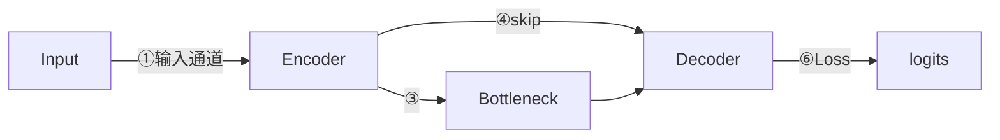
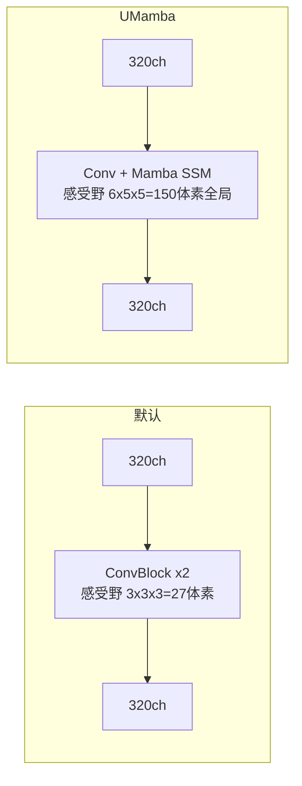

# nnUNet 架构设计图

## nnUNet 是什么

nnUNet 的网络结构就是**最普通的 UNet**——纯卷积，无 Attention，无 Transformer。

```
Conv3d + InstanceNorm3d + LeakyReLU  （×2 per stage）
Encoder → skip concat → Decoder
```

nnUNet 厉害的地方是**自动配置流水线**，给一个新数据集自动算出：
patch size / 下采样层数 / 每层通道数 / batch size / 数据增强策略

这套自动配置让普通 UNet 在大多数医学分割任务上打败花哨架构，
论文标题叫 "nnU-Net: a self-configuring method"，重点在 self-configuring。

---

## 我的数据集的自动配置结果

| 参数 | Dataset003_Liver | Dataset004_LiverTumor |
|------|------------------|-----------------------|
| 任务 | 全 CT，肝脏+肿瘤 | 肝脏 ROI 裁剪后，只分肿瘤 |
| patch_size | 128×128×128 | 96×160×160 |
| batch_size | 2 | 2 |
| spacing (mm) | 1.0 × 0.77 × 0.77 | 1.0 × 0.77 × 0.77 |
| n_stages | 6 | 6 |
| features_per_stage | [32,64,128,256,320,320] | [32,64,128,256,320,320] |
| strides | 全部 2×2×2 | 最后一层 1×2×2 |
| n_conv_per_stage | 全部 2 | 全部 2 |

**kernel_size 全部 3×3×3**（硬编码，非自动配置），唯一例外是输出头的 1×1×1 Conv。
nnUNet 自动配置只管 patch/stages/features/strides/batch，卷积核大小是作者固定的设计决策。

**两个数据集通道配置完全相同**，差异只在 patch size 和最后一层 stride：
- Dataset003 patch 是正方体 128³，最后 stride 可以三轴同时 ×2
- Dataset004 patch 是 96×160×160（z 轴更短），最后一层 z 轴不再下采样（stride 1×2×2），
  避免 z 轴分辨率太低

---

## 基准：PlainConvUNet（nnUNet 默认）

```
  输入(B,1,96×160×160)                                   logits(B,C,96×160×160)
       │ 1ch                                                      ↑
       ↓                                                     1×1 Conv
  ┌───────────────┐                                    ┌───────────────┐
  │  ConvBlock×2  │─── skip₀  32ch  96×160×160 ───────▶│  ConvBlock×2  │
  │  1→32ch       │                                    │  64→32ch      │
  └───────┬───────┘                                    └───────▲───────┘
          ↓ 2×2×2  32ch                                    96ch ↑ 2×2×2
  ┌───────────────┐                                    ┌───────────────┐
  │  ConvBlock×2  │─── skip₁  64ch  48×80×80  ────────▶│  ConvBlock×2  │──▶ DS
  │  32→64ch      │                                    │  128→64ch     │
  └───────┬───────┘                                    └───────▲───────┘
          ↓ 2×2×2  64ch                                   192ch ↑ 2×2×2
  ┌───────────────┐                                    ┌───────────────┐
  │  ConvBlock×2  │─── skip₂  128ch 24×40×40  ────────▶│  ConvBlock×2  │──▶ DS
  │  64→128ch     │                                    │  256→128ch    │
  └───────┬───────┘                                    └───────▲───────┘
          ↓ 2×2×2  128ch                                  384ch ↑ 2×2×2
  ┌───────────────┐                                    ┌───────────────┐
  │  ConvBlock×2  │─── skip₃  256ch 12×20×20  ────────▶│  ConvBlock×2  │──▶ DS
  │  128→256ch    │                                    │  512→256ch    │
  └───────┬───────┘                                    └───────▲───────┘
          ↓ 2×2×2  256ch                                  576ch ↑ 2×2×2
  ┌───────────────┐                                    ┌───────────────┐
  │  ConvBlock×2  │─── skip₄  320ch  6×10×10  ────────▶│  ConvBlock×2  │──▶ DS
  │  256→320ch    │                                    │  640→320ch    │
  └───────┬───────┘                                    └───────▲───────┘
          ↓ 1×2×2  320ch                                  640ch ↑ 1×2×2
          └─────────────────────┐  ┌────────────────────────────┘
                          ┌─────▼──▼─────┐
                          │ ConvBlock×2  │  320→320ch  6×5×5  Bottleneck
                          └──────────────┘

  decoder 输入通道 = upsample输出ch + skip ch（cat拼接）：
    skip₄层：320(up) + 320(skip) = 640ch → 320ch
    skip₃层：320(up) + 256(skip) = 576ch → 256ch
    skip₂层：256(up) + 128(skip) = 384ch → 128ch
    skip₁层：128(up) + 64(skip)  = 192ch →  64ch
    skip₀层： 64(up) + 32(skip)  =  96ch →  32ch

  DS：各 decoder 层 logits 加权求和 → CE + Dice Loss
```

---

## ConvBlock 内部结构

```
  输入 (B, C_in, Z, Y, X)
          │
  ┌───────────────────────────────────────┐
  │  Conv3d  3×3×3  C_in->C_out  stride=s │
  └───────────────────┬───────────────────┘
                      │  stride=1: Z/Y/X 不变
                      │  stride=2: Z/Y/X 减半，通道在此改变
  ┌───────────────────┴───────────────────┐
  │           InstanceNorm3d              │
  └───────────────────┬───────────────────┘
                      │  每个样本独立归一化，不受 batch size 影响
  ┌───────────────────┴───────────────────┐
  │           LeakyReLU(0.01)             │
  └───────────────────┬───────────────────┘
                      │  负数保留 1% 梯度
                      ↓
  输出 (B, C_out, Z', Y', X')

  每个 stage = 上面结构 × 2 串联：
    ConvBlock₁：C_in → C_out，stride=s  （改通道 + 可能下采样）
    ConvBlock₂：C_out → C_out，stride=1  （继续提特征，分辨率不变）

  例：stage 0（32ch，stride=1）      例：stage 1（64ch，stride=2）
    1ch → 32ch, 96×160×160不变          32ch → 64ch, 96×160×160 → 48×80×80
    32ch→ 32ch, 96×160×160不变          64ch → 64ch, 48×80×80 不变
```

---

## 改动点在哪里



| 改动层 | 默认 | 已有改动 | Trainer |
|--------|------|---------|---------|
| ① 输入通道 | 1ch CT | 3ch（CT+概率图+二值图）| `Tr_Stage2_FPSup` |
| ③ Bottleneck | ConvBlock 局部3³ | Mamba Block 全局建模 | `UMamba` 系列 |
| ④ skip | 直接 concat | 未改动 | — |
| ⑥ Loss | CE+Dice | +UFL(δ=0.5/0.6) / +Tversky / +NTFP / MSE+BCE | 各 Loss Trainer |
| **数据集构成** | 原始训练集 | 极小/极大/无肿瘤 case 重复过采样（×3~×8）| `SizeOversample` 系列 |
| **数据集构成** | 原始训练集 | 追加外部无肿瘤 25 case | `Ext25` 系列 |
| **数据集构成** | 全部 case | 只保留有肿瘤 case（故意让模型过敏）| `Tr_Stage1_TumorOnly` |
| **数据增强** | 含镜像翻转 | 关闭镜像 | `NoMirror` 系列 |
| **train_step** | 原始 batch | 50% 概率在线 CopyPaste 小肿瘤 ROI | `CopyPaste` 系列 |

---

## 各改动方案详图

### 方案 A：UMamba — 瓶颈换 Mamba Block



---

### 方案 B：Stage2 FP 抑制 — 输入扩充

```
  默认：                              Stage2（输入扩充）：
  ┌──────────────────┐               ┌──────────────────┐
  │        CT        │               │ CT+Prob+BinMask  │
  └────────┬─────────┘               └────────┬─────────┘
           │ 1ch ──▶ Encoder                  │ 3ch ──▶ Encoder
           ↓                                  ↓
       CE + Dice                          MSE + BCE
                                  Prob=Stage1概率图, BinMask=Stage1二值图
                                  学会擦除 Stage1 假阳性
```

---

### 方案 C：Loss 叠加 — 网络不变，只改损失

```
  logits (B, C, Z, Y, X)
        │
        ├─ [默认]   CE + Dice
        │
        ├─ [UFL]    CE + Dice  +  λ·AsymmetricUFL(肿瘤通道)
        │                         δ=0.6 → 重罚漏检 FN
        │                         δ=0.5 → FN/FP 对称
        │
        ├─ [Tversky] CE + Dice  +  FocalTversky(δ=0.7, γ=0.75)
        │
        └─ [NTFP]   CE + Dice  +  λ·mean(p_tumor)  [仅 GT 无肿瘤 patch]
```

---

## 还没动过的改动点（潜在思路）

```
  ④ skip 处 加 Attention Gate：
     现在：skip 直接 concat 到 decoder
     改成：skip × sigmoid(f(decoder_feat))
           让 decoder 主动决定 skip 里哪些位置重要

  ② 高分辨率层（32ch/64ch）：
     离肿瘤边界最近，精细轮廓在这里
     → ConvBoundaryLoss 从这里提取边界响应

  多任务头（在最终 1×1 Conv 处分叉）：
     现在：单一分割 logits
     改成：分割头 + 距离场预测头（并行）
```
