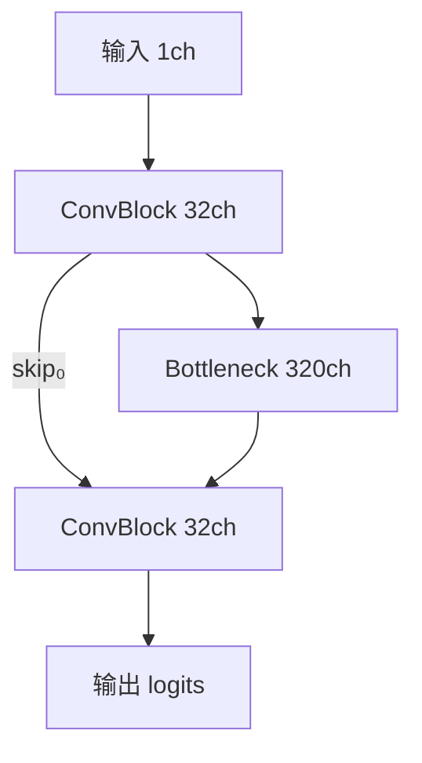
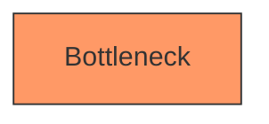

### 代理,环境,代码,踩坑,git,python,latex,

---

## Claude Code 代理机制（2026-04-20）

### 链路全貌

```
Claude Code (Node.js)
    ↓ HTTP proxy (环境变量)
privoxy :8118          ← HTTP→SOCKS5 转换器
    ↓ SOCKS5 forward
clash :7891            ← 代理客户端（配置文件 ~/qi77_clash.yaml）
    ↓ 美国节点出口
api.anthropic.com
```

### 为什么要 privoxy 这一层

Claude Code 基于 Node.js，Node.js **只认 HTTP 代理**，不支持 SOCKS5。
Clash 默认暴露 SOCKS5（7891），所以需要 privoxy 做协议转换。

### 关键配置

**Clash 启动：**
```bash

nohup /usr/bin/clash -d /home/pumengyu/ -f /home/pumengyu/qi77_clash.yaml > /tmp/clash.log 2>&1 &

```
- 代理端口：`7891`（socks5）
- API 管理端口：`9090` 或 `9091`

**privoxy 转发规则（`/etc/privoxy/config`）：**
```
forward-socks5 / 127.0.0.1:7891 .
listen-address  127.0.0.1:8118
```

**环境变量（每次开 shell 需要 export，或加到 ~/.bashrc）：**
```bash
export http_proxy=http://127.0.0.1:8118
export https_proxy=http://127.0.0.1:8118
export HTTP_PROXY=http://127.0.0.1:8118
export HTTPS_PROXY=http://127.0.0.1:8118
```

### 一键诊断脚本

```bash
bash ~/fix_claude.sh
```

脚本逻辑：
1. 测 `socks5://7891` → `api.anthropic.com`，不通则自动遍历所有 Clash 节点切换
2. 测 `http://8118` → `api.anthropic.com`，不通则重装/修复 privoxy
3. 打印需要 export 的环境变量

### 手动切换节点

```bash
# 查看所有节点
curl -s --noproxy '*' http://127.0.0.1:9090/proxies | python3 -m json.tool | grep '"name"'

# 切换到指定节点
curl -X PUT http://127.0.0.1:9090/proxies/GLOBAL \
  -H "Content-Type: application/json" \
  -d '{"name":"节点名"}'
```

Python 脚本批量测试（`notebooks/VPN.py`）：遍历所有节点，找第一个能通的。

### 验证是否通了

```bash
# 返回 404 = Anthropic 服务器收到了请求，说明代理正常
curl -x socks5://127.0.0.1:7891 https://api.anthropic.com -o /dev/null -w "%{http_code}"
curl -x http://127.0.0.1:8118  https://api.anthropic.com -o /dev/null -w "%{http_code}"
```

### 实际用的是谁的 clash（2026-04-20 核查）

机器上同时跑着 **3 个 clash 进程**：

| 进程用户 | 配置文件 | 代理端口 | 能不能通 Anthropic |
|----------|----------|----------|-------------------|
| root (songpeibo) | `/srv/clash/config.yaml` | 未知（无权限看） | ❌ 所有猜测端口均 000 |
| ZhaoPu | `/home/ZhaoPu/1775529590563.yml` | 占用 7891 之一 | ✅ |
| ZhaoPu | `/home/ZhaoPu/qi77_clash.yaml` | 占用 7891 之一 | ✅ |

**结论：我用的是 ZhaoPu 的 clash（端口 7891），在蹭 ZhaoPu 的机场流量。**

### 为什么系统级 clash（root/songpeibo）不能用

- 系统 clash 的端口无法确定（无权读 `/srv/clash/config.yaml`）
- 测试了 7890/2080/2081/4080/7000 等所有监听端口，全部返回 000（连接失败）
- 推测：系统 clash 的节点没有覆盖 Anthropic，或出口 IP 被封，或端口绑定了特定用户/网络接口

### 为什么 ZhaoPu 的可以用

- ZhaoPu 的 clash 端口 7891 绑定在 `0.0.0.0`（对全机器所有用户开放）
- 节点配置里有能访问 Anthropic 的美国节点
- 我的 privoxy（8118）→ 转发到 7891 → 走 ZhaoPu 的节点出去

### 隐患

1. **随时可能断**：ZhaoPu 重启/停止 clash，7891 消失，Claude Code 立刻失效
   - 这很可能就是今早5小时修不好、最后"自己好了"的真正原因——**不是我修好的，是 ZhaoPu 重启了 clash**
2. **无法切节点**：ZhaoPu 的 clash API 端口没有暴露（或有密码），无法用 `/proxies` 接口换节点
   - `fix_claude.sh` 里切节点的逻辑对 ZhaoPu 的 clash 无效
3. **消耗 ZhaoPu 的流量**：机场套餐通常有月流量上限，我用的都算 ZhaoPu 的
4. **没有自主控制**：节点质量、可用性完全依赖 ZhaoPu

### 长期建议

自己买机场，在 `~/qi77_clash.yaml` 里填自己的节点，自己起 clash：
```bash
nohup /usr/bin/clash -d /home/pumengyu/ -f /home/pumengyu/qi77_clash.yaml > /tmp/clash.log 2>&1 &
```
这样节点切换、故障排查全部可控，不依赖别人。

### 踩坑记录（2026-04-20 早上，耗时约5小时）

折腾了约5小时，尝试了大量修复（clash重启、privoxy重装、节点切换、环境变量、配置核查等），
在 Claude 网页版辅助下做了很多操作，**但最终是它自己好的**，不知道是什么时间点恢复的。

**真正原因（事后推断）：ZhaoPu 的 clash 进程出了问题，ZhaoPu 自己修好/重启了，与我的操作无关。**

**教训：**
- 先确认是自己机器的问题还是依赖方（ZhaoPu clash）的问题
- `curl -x socks5://127.0.0.1:7891 https://api.anthropic.com` 如果返回 000，说明 7891 根本没在服务，找 ZhaoPu
- `fix_claude.sh` 里的切节点逻辑对 ZhaoPu 的 clash 无效，不要在上面浪费时间

---

## 1. 建文件夹和四个文件
mkdir ~/notes && cd ~/notes
touch tech.md research.md ideas.md inbox.md

## 2. 初始化Git
git init
git add .
git commit -m "init"

## 3. 去GitHub新建一个私有仓库，叫notes，然后：
git remote add origin git@github.com:你的用户名/notes.git
git push -u origin main


git add . && git commit -m "update" && git push


git clone git@github.com:你的用户名/notes.git


import argparse
import yaml

---

## ASCII 架构图画法

### 可用字符

```
框线：┌ ┐ └ ┘ │ ─
分叉：┬ ┴ ├ ┤
箭头：▲ ▼ ▶ ◀ ↑ ↓ → ←
```

### 三条核心规则

**① 注释放连线上，不放框后**
```
× 错：│ ConvBlock │  128ch 24×40×40     ← 破坏右侧对称
✓ 对：── skip  128ch 24×40×40 ────────▶  ← 注释在连线中间
```

**② 左右对称结构：框宽必须完全一致**
```
┌───────────────┐        ┌───────────────┐   ← 同宽
│  ConvBlock×2  │        │  ConvBlock×2  │
└───────┬───────┘        └───────▲───────┘   ← 连接点同列
        ↓                        ↑
```

**② 框内只用英文/数字，中文写在框外**
```
× 错：│  概率图  │   ← 中文占2格，框线按1格算，永远错位
✓ 对：│  Prob    │   ← 框内英文，框下另起一行写中文说明
```

**③ 两线汇合写法**
```
└──────┐  ┌──────┘
  ┌────▼──▼────┐
  │ Bottleneck │
  └────────────┘
```

### 给 AI 的提示词

```
用 ASCII 画架构图，严格遵守：
- 左右两侧框字符数完全一致，框后不追加任何注释文字
- 通道数/分辨率等信息只标在连线中间
- 上下对应元素从同一列开始
- 两线汇合用：左 └──┐ + 右 ┌──┘，下接 ┌──▼──▼──┐
- 画完检查：每个框的上边和下边等长，左右框的 │ 在同一列
```

### 工具选型

| 场景 | 工具 |
|------|------|
| 线性流程 / 简单示意 | ASCII |
| 对称结构（UNet 等）| Mermaid |
| 论文正式图 | draw.io → 导出 SVG/PDF |

---

## Mermaid

### VS Code 配置（Linux）

安装插件：**Markdown Preview Mermaid Support**
```
id: bierner.markdown-mermaid
```
预览：`Ctrl+Shift+V`（与普通 markdown 预览相同，自动渲染 mermaid 块）

### 常用语法

**流程图**
````

````

**方向**：`TD`（从上到下）/ `LR`（从左到右）

**加颜色**
````

````

### Mermaid 的局限
- 节点位置由算法决定，无法手动精确控制
- 复杂图容易布局乱
- 论文图用 draw.io
