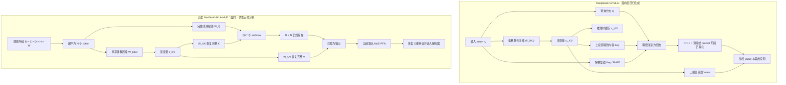
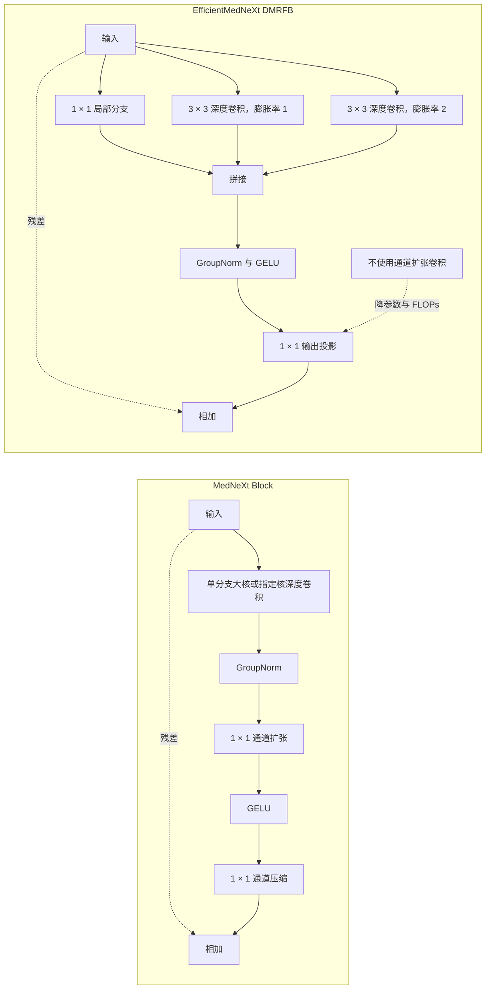

# 多域训练与外部可靠性实验跟进

> 用途：在继续整理 `正式论文v3_MedNeXt_MLA框架.md` 格式的同时，独立跟进结构消融、多域训练、外部可靠性和统计验证实验。
>
> 原则：不以工作量最小为目标，优先选择科学问题重要、贡献强且证据严格的方案；但实验数量增加不能替代数据隔离、标签质量和统计可信度。

## 1. 升级后的核心研究问题

本文不再只回答“MedNeXt 加入 MLA 后 Dice 是否提高”，而是回答：

> 在三维肝肿瘤分割中，结构设计、训练数据域与训练策略如何共同决定模型的外部可靠性？低分辨率全局上下文、多域联合训练和风险感知模型选择分别贡献了什么？
Dataset003/LiTS=一个数据域
HCC=一个数据域
3D-IRCADb=一个外部数据域

风险感知模型:训练或者选模型,显式考虑漏检,误报,和最差的域风险

结构设计:网络由哪些模块组成,模块如何连结

训练数据:真正参与梯度更新的影像和标签
训练策略:如何采样,计算损失,优化和选择checkpoint

外部可靠性:模型在未参与训练和调参的数据来源上是否稳定


最终希望形成三层证据：

1. **结构层**：严格区分无 Attention、标准 MHA、低秩 K/V MLA 和高效多感受野卷积的作用。
2. **训练层**：比较单域训练、直接联合训练、域平衡训练和风险感知训练。
3. **可靠性层**：在已见域 held-out test 与完全未知外部域上评价平均性能、病灶检出、假阳性、严重失败和不确定性。

## 2. 预期贡献

### 2.1 结构贡献

- 在 MedNeXt-L 最低空间分辨率 bottleneck 引入全局 token 交互，同时保留高分辨率卷积路径。
- 通过同位置、同 block 数、同 head 数和尽量相同 FFN 的对照，判断收益来自全局 Attention、低秩 K/V，还是额外参数。
- 引入 EfficientMedNeXt 及其 MLA 变体，检验多感受野卷积与低分辨率全局上下文是否互补。

#### 2.1.1 DeepSeek MLA 与当前三维 MLA 的结构边界

先明确一个容易混淆的结论：**只要仍然使用所有 token 两两交互的稠密 softmax Attention，MLA 就仍然需要计算 N × N 的注意力分数。**

- 标准稠密 Attention 的分数矩阵为 $$A = softmax(QK^T / \sqrt{d_{h}})$$，其形状为 B × h × N × N。
- DeepSeek-V2 MLA 的主要目标是压缩自回归生成时需要跨解码步长期保存的 K/V cache，而不是把稠密 Attention 变成线性复杂度。
- 在三维分割中，一个体数据通常一次性前向计算，没有逐 token 生成和跨解码步复用 KV cache 的需求。因此，DeepSeek MLA 最重要的部署收益不能直接照搬到本文。
- 当前实现仍显式恢复完整 K、V，并构造 N × N 注意力矩阵；它能够直接主张的是 K/V 投影低秩化和参数减少，不能主张消除了二次复杂度。
- 当前设计之所以可运行，主要因为 MLA 只放在最低分辨率瓶颈。例如 D = H = W = 8 时，N = 8 × 8 × 8 = 512，而不是因为低秩 K/V 消除了 N²。

**图 1　DeepSeek-V2 原版 MLA 与当前三维分割 MLA 的数据流对比**



图中最关键的区别不是“有没有 N × N”，而是是否存在自回归 KV cache 场景。DeepSeek-V2 可以只缓存低维 cₜ_KV，并在推理部署中进行投影吸收；当前分割实现没有这一缓存复用过程，而且没有实现解耦 RoPE 等完整组件。因此，论文中应称为“MLA 风格的低秩 K/V 自注意力”，而不是“完整复现 DeepSeek MLA”。

早期 `nnUNetTrainer_MedNeXt_MLA` 实际把注意力后的普通 MLP 换成了 MoE-FFN；该历史实现、checkpoint 和结果目录现已迁移为 `MedNeXt_MLA_MoE`。无后缀 `MedNeXt_MLA` 已改为标准 MLP，补跑后可与同 FFN 的 MHA 对照，从而把低秩 Attention 的作用与 MoE 的作用分开。

#### 2.1.2 MedNeXt、EfficientMedNeXt 与历史 MedNeXt-MLA-MoE 对比

**图 2　三种网络的整体改动位置**

```mermaid
flowchart TB
    subgraph M[MedNeXt-L：当前卷积基线]
        MI[三维影像] --> ME[完整 MedNeXt 编码器]
        ME --> MB[卷积 Bottleneck]
        MB --> MD[完整高分辨率 MedNeXt 解码器]
        ME -. 多尺度 skip .-> MD
        MD --> MO[分割输出]
    end

    subgraph E[EfficientMedNeXt：整体效率重构]
        EI[三维影像] --> EE[DMRFB 编码器]
        EE --> EB[DMRFB Bottleneck 与降通道]
        EB --> ED[统一低通道解码器]
        EE -. DMRFB 精炼并对齐通道的 skip .-> ED
        ED --> EO[多尺度输出 / 分割输出]
        CUT[移除最高分辨率解码阶段] -. 减少冗余 .-> ED
    end

    subgraph O[历史 MedNeXt-MLA-MoE：保留大骨干并增加全局模块]
        OI[三维影像] --> OE[原 MedNeXt-L 编码器]
        OE --> OB[原卷积 Bottleneck]
        OB --> MLA[低秩 K/V 全局 Attention]
        MLA --> FFN[当前默认 MoE-FFN]
        FFN --> OD[原 MedNeXt-L 解码器]
        OE -. 原多尺度 skip .-> OD
        OD --> OO[分割输出]
    end
```



**图 3　核心卷积块差异**



| 比较项 | MedNeXt-L | EfficientMedNeXt | 历史 MedNeXt-MLA-MoE |
|---|---|---|---|
| 主要目标 | 强卷积分割基线 | 精简参数、FLOPs 和高分辨率冗余 | 增加瓶颈全局空间交互 |
| 基本块 | 深度卷积 + 通道扩张/压缩 | 并行空洞深度卷积 DMRFB，不使用扩张卷积 | 主干仍是原 MedNeXt Block |
| 上下文 | 以局部卷积和层级下采样扩大感受野 | 多膨胀率的多尺度局部上下文 | 卷积局部上下文 + 瓶颈全局 Attention |
| 解码器 | 完整、逐级恢复高分辨率 | 统一并降低通道，移除最高分辨率解码阶段 | 保留原 MedNeXt-L 解码器 |
| Skip | 原 MedNeXt skip | 先经 DMRFB 精炼并对齐通道 | 保留原 MedNeXt skip |
| N × N Attention | 无 | 无 | 有，但只在低分辨率 bottleneck |
| 参数趋势 | 大 | 显著减少 | 在 MedNeXt-L 基础上增加 |

因此，EfficientMedNeXt 不是“更新版 MLA”，也不是简单替代当前模块。它回答的是卷积主干能否更高效；当前 MLA 回答的是低分辨率全局交互是否改善三维肿瘤分割及外部可靠性。合理的实验关系是将 EfficientMedNeXt 作为新卷积基线，再测试 EfficientMedNeXt-MLA 是否互补，而不是预设其中一个必然优于另一个。

#### 2.1.3 Trainer 命名补救与历史结果映射

checkpoint 参数键审计确认：早期 `nnUNetTrainer_MedNeXt_MLA` 和 `nnUNetTrainer_MedNeXt_MLA_SizeOV4` checkpoint 均包含 MoE 的 `mla_bot.blocks.*.ffn.*` 参数，而不包含普通 MLP 的 `mla_bot.blocks.*.mlp.*` 参数。现已将这些历史类、结果目录和 checkpoint 内部 `trainer_name` 迁移到带 `_MoE` 的准确名称；无后缀 trainer 改为真正关闭 MoE 的纯 MLA 实验入口。

| 论文/新实验方法名 | Trainer | 实际结构 | 用途 |
|---|---|---|---|
| MedNeXt_MLA_MoE | `nnUNetTrainer_MedNeXt_MLA_MoE` | MLA + MoE-FFN | 已有 checkpoint 和论文数字迁移后的正式名称 |
| MedNeXt_MLA | `nnUNetTrainer_MedNeXt_MLA` | MLA + 标准 MLP | 已完成，用于隔离 MLA 作用 |
| MedNeXt_MLA_MLP | `nnUNetTrainer_MedNeXt_MLA_MLP` | MLA + 标准 MLP | 与无后缀纯 MLA 相同的显式别名 |
| MedNeXt_MHA | `nnUNetTrainer_MedNeXt_MHA` | 标准 MHA + 标准 MLP | 与 MLA 严格比较；历史名为 MedNeXt_Transformer |
| MedNeXt_MHA_MoE | `nnUNetTrainer_MedNeXt_MHA_MoE` | 标准 MHA + MoE-FFN | 与历史 MLA_MoE 严格比较 |
| MedNeXt_MLA_MoE_SizeOV4 | `nnUNetTrainer_MedNeXt_MLA_MoE_SizeOV4` | MLA + MoE-FFN + SizeOV4 | 已有 checkpoint 和论文数字迁移后的正式名称 |

禁止将 `MedNeXt_MLA_MoE` 的历史数字改写成纯 `MedNeXt_MLA` 结果。纯 MLA 已使用当前无后缀 `nnUNetTrainer_MedNeXt_MLA` 独立完成内部与 IRCADb 评估；HCC 结果仍须按数据域单独核对。

### 2.2 多域训练贡献

- 在严格隔离 test set 的前提下联合使用 Dataset003 与 HCC 训练数据。
- 比较直接混合、域平衡、肿瘤大小平衡和风险感知训练。
- 保留 3D-IRCADb 为完全未知域，检验联合训练能否改善未见域，而不只是记住目标域。

### 2.3 可靠性评价贡献

- 统一 checkpoint、病例清单、指标、报告和可视化口径。
- 同时报告 Dice、Recall、Precision、病灶级检出、无肿瘤 FP、病灶大小分组和严重失败。
- 使用病例级 bootstrap 95% CI、配对差异和多次训练结果，避免仅凭单次平均 Dice 下结论。

### 2.4 作用边界与负结果

- 检验 MLA 收益能否跨 IRCADb 与 HCC 重现。
- 检验 bottleneck-only Adapter 的负迁移是否来自适配位置过窄。
- 区分输入强度、早期局部特征、skip feature、bottleneck 语义和解码边界恢复对域偏移的影响。

## 3. 数据隔离与命名

### 3.1 Dataset003/LiTS 风格源域

- Train：92 例。
- Validation：13 例，仅用于监控和 checkpoint 选择。
- Internal test：26 例，只用于最终评价，禁止进入训练、调参或 checkpoint 选择。

### 3.2 HCCReferencedCT v2

- Train：70 例。
- Validation：10 例，仅用于 HCC 或多域训练的验证。
- Held-out test：21 例，只用于最终评价。
- 当前 101 例均有肿瘤标注，因此无肿瘤 FP rate 必须写为 `N/A`。

### 3.3 3D-IRCADb

- 20 例：15 例有肿瘤，5 例无肿瘤。
- 全部保留为完全未知外部测试域。
- 禁止用于训练、超参数选择、阈值选择和 checkpoint 选择。

### 3.4 结果命名必须区分

- `source-only`：只用 Dataset003 train 训练。
- `HCC-only`：只用 HCC train 训练。
- `multi-domain`：Dataset003 train 与 HCC train 联合训练。
- `adapted`：从 source-only checkpoint 出发，使用 HCC train 适配。
- `known-domain test`：训练中出现过该数据域，但测试病例严格 held out。
- `unseen-domain external test`：训练与模型选择均未出现该数据域，例如 IRCADb。

## 4. 实验矩阵

### 4.1 阶段 A：现有产物与 checkpoint 审计

在启动新训练前，对所有候选方法逐项核查：

- checkpoint 文件名、epoch、修改时间、trainer、fold 和来源；
- `checkpoint_best.pth` 是否可能被短试跑覆盖；
- 预期病例清单与实际预测病例数；
- 陈旧或额外预测文件；
- `summary.json`；
- 人类可读 `.txt` 报告；
- `test_viz/` PNG 数量；
- 运行中、部分完成、失败和未开始的方法。

未经审计通过的结果不得进入论文主表。

### 4.2 阶段 B：结构因果实验

| ID | 方法 | 关键变量 | 主要目的 | 当前状态 |
|---|---|---|---|---|
| S0 | MedNeXt | 无 Attention | 强卷积基线 | 未审计 |
| S1 | MedNeXt_MHA_MLP（现有 Transformer） | 标准 MHA + 标准 MLP | 普通 Transformer bottleneck | 未审计 |
| S2 | MedNeXt_MHA_MoE | 标准 MHA + MoE-FFN | 与 S4 严格隔离低秩 K/V 作用 | 未开始 |
| S3 | MedNeXt_MLA | 低秩 K/V + 标准 MLP | 与 S1 严格隔离低秩 K/V 作用 | 未开始 |
| S4 | MedNeXt_MLA_MoE | 低秩 K/V + MoE-FFN | 已迁移的历史主结构 | 未审计 |
| S5 | EfficientMedNeXt | 多感受野空洞卷积 | 高效卷积新基线 | 未开始 |
| S6 | EfficientMedNeXt_MLA | 高效卷积 + bottleneck MLA | 检验局部多尺度与全局上下文互补 | 未开始 |

扩展消融：

- MLA compression ratio：2、4、8；
- MLA block 数：1、2、4；
- 插入位置：bottleneck、encoder high-level、必要时多尺度；
- 融合方式：顺序、残差、门控；
- 三维位置信息：无位置编码与候选位置编码。

每个关键结构至少运行 3 个随机种子；若时间与存储允许，优先增加多 fold，而不是继续增加未经隔离的新模块。

### 4.3 阶段 C：多域训练基线

先使用结构实验中最可信的 1–2 个骨干，比较：

| ID | 训练数据与策略 | Dataset003 test | HCC test | IRCADb | 当前状态 |
|---|---|---:|---:|---:|---|
| D0 | Dataset003-only | 内部测试 | source-only 外部 | unseen external | 未审计 |
| D1 | HCC-only | 跨域测试 | known-domain held-out | unseen external | 未开始 |
| D2 | Dataset003 + HCC 直接混合 | known-domain held-out | known-domain held-out | unseen external | 未开始 |
| D3 | Dataset003 + HCC 域平衡采样 | known-domain held-out | known-domain held-out | unseen external | 未开始 |
| D4 | 域平衡 + 肿瘤大小平衡 | known-domain held-out | known-domain held-out | unseen external | 未开始 |
| D5 | 域平衡 + 风险感知训练/选择 | known-domain held-out | known-domain held-out | unseen external | 未开始 |

多域训练不得把两个数据集简单拼接后忽略样本量差异。必须记录每个 epoch/iteration 中各域、各病灶大小组和无肿瘤病例的实际采样次数。

### 4.4 阶段 D：适配位置与域偏移来源

| ID | 适配范围 | 目的 | 当前状态 |
|---|---|---|---|
| A0 | bottleneck-only Adapter | 复核当前负迁移 | 未审计 |
| A1 | 仅输入/stem 或浅层 Adapter | 检验强度与低级纹理偏移 | 未开始 |
| A2 | 多尺度 skip Adapter | 检验 encoder 多尺度域偏移 | 未开始 |
| A3 | decoder Adapter | 检验边界恢复与标注风格偏移 | 未开始 |
| A4 | 全网络 fine-tuning | 适配上限对照 | 未开始 |
| A5 | 域特异归一化或轻量域条件化 | 检验共享骨干下的域差异 | 未开始 |

只有在 A0 结果和特征分布分析复核后，才决定 A1–A5 的最终实现细节，避免同时改变过多因素。

### 4.5 阶段 E：风险感知训练与模型选择

候选方向：

- tiny/small lesion recall-aware sampling 或 loss；
- no-tumor FP-safe loss/regularization；
- hard-case mining；
- 多域最差性能约束；
- 跨域性能差异惩罚；
- 阈值校准与连通域后处理作为独立对照，不与结构收益混合。

候选 checkpoint 选择目标：

$$
S_{select}=\operatorname{mean}(S_{MSD},S_{HCC})
-\lambda|S_{MSD}-S_{HCC}|-\gamma R_{FP}.
$$

该公式目前只是待验证候选，不能直接作为论文贡献。必须先比较：

1. 单域 validation Overall；
2. 两域 mean Overall；
3. worst-domain Overall；
4. 加入 FP 风险项的选择规则。

模型选择规则必须在查看 IRCADb 和 held-out test 结果前固定。

## 5. 两组 GPU 分工

### GPU 组 A：结构实验

- S1–S6 主结构；
- compression ratio、block 数和插入位置消融；
- 参数量、FLOPs、峰值显存、训练吞吐和推理时间；
- 关键结构多 seed。

### GPU 组 B：多域训练与适配

- D1–D5；
- A0–A5；
- 风险感知采样、loss 和 checkpoint 选择；
- 最优训练策略的多 seed 或多 fold。

两个 GPU 组可以并行，但必须共享同一数据划分文件、方法注册表、评估病例清单和报告脚本。

## 6. 评价与统计

### 6.1 必报指标

- Liver Dice；
- Tumor Dice；
- Overall；
- voxel-level Recall、Precision；
- lesion-level detection rate；
- no-tumor case FP rate，仅在存在阴性病例时报告；
- internal-external drop；
- severe failure 数；
- Dice 不低于预设阈值的病例数；
- tiny/small/medium/large 分组指标。

### 6.2 统计要求

- 病例级 bootstrap 95% CI；
- 同一病例上的模型配对差异；
- 多 seed 均值与标准差；
- 预先规定主终点和次终点；
- 小样本外部集不使用“统计证明普遍优越”等表述。

### 6.3 机制与失败分析

- FP 与 FN 贡献分解；
- 无肿瘤病例预测体积或概率分布；
- 不同病灶大小的 Recall/Precision；
- 连续切片上的漏检、提前预测和边界外溢；
- bottleneck/skip feature 分布与可视化；
- 标准 MHA 与 MLA 的病例级改善是否一致。

## 7. 单项实验“完整”的定义

每个“方法 × 数据域 × seed/fold”只有同时具备以下产物，才标记为完整：

1. 全部预期病例的 NIfTI 预测；
2. `summary.json`；
3. 人类可读 `.txt` 报告；
4. `test_viz/` 及实际 PNG；
5. dataset、trainer、fold、seed、checkpoint 文件名、epoch、修改时间和模型来源；
6. 运行日志和失败记录。

状态统一使用：

- **未开始**：没有正式运行；
- **运行中**：训练或推理进程仍在执行；
- **预测完成**：预测病例齐全，但报告或可视化未齐；
- **部分完成**：已有部分必要产物；
- **完整完成**：上述六类产物全部通过检查；
- **失败**：流程中断或结果无效，必须记录原因；
- **无效**：checkpoint 来源可疑、病例清单错误或发生测试泄漏。

禁止用“目录存在”“终端打印过指标”或“预测文件大致齐全”替代完整性检查。

## 8. 论文回填位置

| 实验结论 | 论文位置 |
|---|---|
| MHA 与 MLA 严格对照 | 3.3、5.3、7.2 |
| EfficientMedNeXt 对照 | 2.2、4.4、5.2 |
| 多域训练方法 | 方法中新建小节、实验设计、结果主表 |
| 已见域与未见域结果 | 摘要、5.1、5.7、讨论 |
| 风险感知训练/选择 | 方法、评价指标、消融 |
| 适配位置实验 | 5.8、局限性 |
| 置信区间与配对统计 | 4.3、所有主结果表 |
| 视觉与病例级失败分析 | 第 6 节、讨论和局限性 |

在实验完成前，主论文只保留研究问题和待验证假设，不预写“优于”“显著提升”或“普遍改善”等结论。

## 9. 决策门

### Gate 1：结构贡献是否成立

- 若 MLA 稳定优于同位置 MHA，保留“低秩 K/V 结构收益”主张。
- 若 MLA 与 MHA 接近，贡献改为“低分辨率全局上下文”，低秩路径只作为参数效率设计。
- 若 MHA 优于 MLA，不隐瞒结果，主线转向结构位置与外部可靠性。

### Gate 2：多域训练是否成立

- 若 D3–D5 同时改善已见域与 IRCADb，形成多域训练方法贡献。
- 若只改善 HCC、损害 IRCADb，定义为目标域适配而非域泛化。
- 若直接混合已足够，不增加无必要复杂模块，重点研究采样和模型选择机制。

### Gate 3：最终论文主角

- 结构收益最强：以严格消融后胜出的 MedNeXt_MLA_MLP、MedNeXt_MLA_MoE 或 EfficientMedNeXt_MLA 为主。
- 多域训练收益最强：以多域可靠性训练为主，结构作为骨干消融。
- 两者互补：形成“结构 × 数据 × 可靠性”的完整主线。
- 均不稳定：以严格负结果、外部失效和验证方法为核心，降低方法创新表述。

## 10. 当前总状态

截至本文件创建时：

- 预期结构主方法：7 个（S0–S6）。
- 预期多域训练设置：6 个（D0–D5）。
- 预期适配设置：6 个（A0–A5）。
- 现有结果的 checkpoint 与完整产物：**未在本跟进流程中重新审计**。
- 新增 EfficientMedNeXt、严格 MHA、联合训练和风险感知实验：**未开始**。
- 当前运行中项目：**未验证**。
- 当前失败项目：**未验证**。

第一次正式更新必须先完成阶段 A 审计，再填写每个方法在 Dataset003、HCC 和 IRCADb 上的预测病例数、`summary.json`、报告、PNG 数和 checkpoint 状态。

## 11. 每次更新模板

```text
日期与时间：
实验 ID：
GPU 组：A / B
数据域与划分：
trainer / fold / seed：
checkpoint：
checkpoint epoch / mtime / 来源检查：通过 / 失败 / 未验证
训练状态：未开始 / 运行中 / 完成 / 失败
预测病例：实际 / 预期
summary.json：有 / 无
txt 报告：有 / 无
test_viz PNG：数量
当前阶段：训练 / 预测 / 报告 / 可视化 / 统计
主要结果：
失败或异常：
下一步：
是否允许进入论文：是 / 否，原因：
```

## 12. 与既有计划的关系

- 本文件负责最高贡献路线、实验调度、完整性审计和论文回填。
- `MedNeXt_MLA贡献成立条件与补强计划.md` 继续保留，作为 MLA 结构贡献的详细技术依据。
- 两份文件发生冲突时，以实际代码、数据划分、checkpoint 审计和最新完整实验产物为准，并在本文件记录变更原因。
