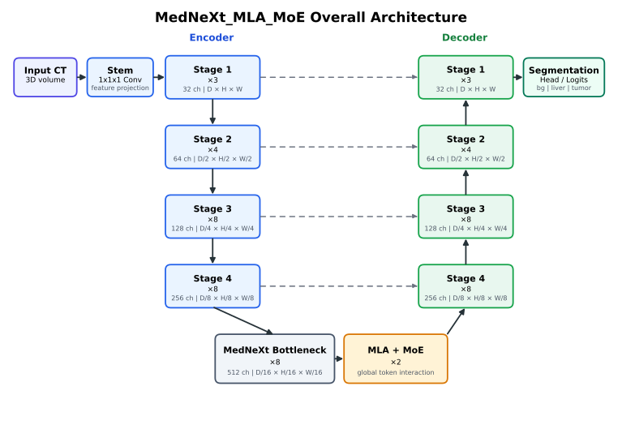
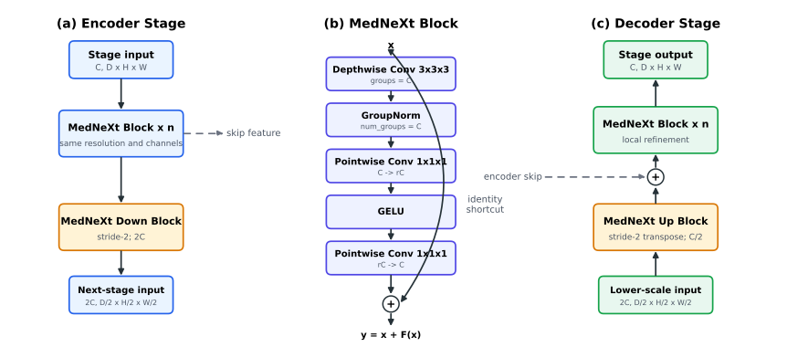
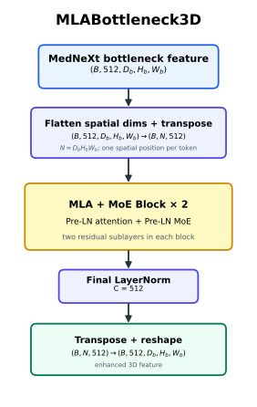
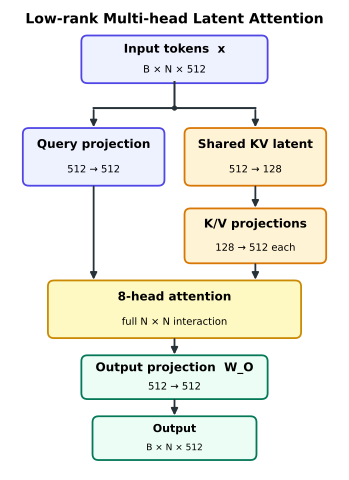
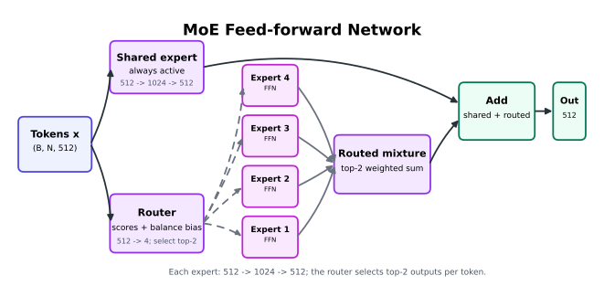

# 面向外部可靠性的肝肿瘤 CT 分割：基于 MedNeXt_MLA_MoE 的跨数据集验证与视觉歧义分析

**作者**：普孟玉  
**单位**：数学学院

---

## 摘要

$\quad$基于 CT 的肝脏与肝肿瘤三维语义分割是医学图像分析中的一项基础任务，可辅助临床医生定量评估病灶负荷、制定治疗方案并监测疾病进展。近年来，基于全卷积网络的 U 形架构已成为三维医学图像分割的主流范式。然而，卷积层有限的核尺寸使其难以显式建模局部疑似病灶与肝脏整体形态之间的远距离依赖，因而在肿瘤尺度变化显著、对比度较低或局部外观相似时容易出现漏检与误报。另一方面，Transformer 能够通过自注意力捕获长程依赖并建立全局上下文，但在高分辨率三维特征上对全部体素 token 进行全局交互会产生高昂的计算与显存开销，且整体替换卷积编码器和解码器可能削弱对局部纹理与精细边界的归纳偏置。受强卷积骨干与全局注意力互补性以及 DeepSeek-V2 Multi-head Latent Attention（MLA）低秩键值表示思想的启发，本文构建 MedNeXt_MLA_MoE 混合分割架构。具体而言，该模型保留 MedNeXt-L 编码器、解码器及多尺度跳跃连接，仅将最低空间分辨率的 bottleneck 特征展平为 token 序列，并通过由简化 MLA-style 低秩键值自注意力与 MoE-FFN 组成的 bottleneck block 进行全局交互和特征变换。本文建立包含 30 种 Dataset003 source-only 配置的公平比较池，在 Dataset003/LiTS 风格内部测试集、3D-IRCADb 和 HCCReferencedCT v2 外部测试集上分别评价，并完成 MHA/MLA × MLP/MoE 的三域 2×2 消融。MedNeXt_MLA_MoE 在 3D-IRCADb 上取得 Overall 0.8511、Tumor Dice 0.7349，并将无肿瘤误报率由原始 MedNeXt 的 60% 降至 40%；但在 HCCReferencedCT v2 上，纯 MedNeXt_MLA 以 Overall 0.6532 排名第一，MedNeXt_MLA_MoE 为 0.6261。严格消融进一步显示，MoE 在 MLA 路径下提高 internal/IRCADb Overall，却降低 HCC Overall；在 MHA 路径下则使三个数据域的 Overall 均小幅下降。上述结果支持强局部卷积表征与低分辨率全局上下文互补的设计方向，同时说明 attention–FFN 作用具有明显数据域依赖性，不能将单一外部数据集上的收益归因于某个组件的统一泛化能力。

**关键词**：肝肿瘤分割；MedNeXt；潜在注意力；跨数据集验证；外部可靠性；视觉歧义
codex resume 019f74e7-34ff-7871-b46c-38c7afd64f73
---

## 1. 引言

$\quad$肝细胞癌、肝转移瘤等恶性肿瘤是临床影像诊断和治疗决策中的重要对象。在肝肿瘤的诊断与治疗过程中，从 CT 影像中准确勾画肝脏和肿瘤范围，可用于定量评估病灶负荷、制定手术、放疗或局部治疗方案，并在随访中判断疗效与疾病进展。自动三维分割有望减轻逐层手工勾画的时间成本和观察者差异，因而对临床影像工作流、智能辅助诊疗产品以及可重复的肿瘤定量研究都具有价值。

$\quad$肝肿瘤分割也是三维医学图像分析中具有代表性的研究任务。肝脏与肿瘤在体积尺度、边界清晰度、强化模式和类别分布上存在显著差异，极小病灶和低对比度病灶容易被遗漏，邻近血管或其他低密度结构则可能被误判为肿瘤。因此，该任务不仅要求模型刻画局部纹理和精细边界，还要求其利用肝脏整体形态及病灶间的三维空间关系，在类别不平衡条件下保持稳定的检出与分割能力。

$\quad$ U-Net 的层次化编码器—解码器和跳跃连接奠定了现代医学图像分割的基本范式 [U-Net-2015]，nnU-Net 进一步通过系统化配置数据预处理、网络结构、训练策略和推理流程建立了具有竞争力的强基线 [nnU-Net-2021]。MedNeXt 将 depthwise inverted bottleneck、残差上下采样等现代卷积设计引入三维 U 形网络，增强了局部结构表征和网络扩展能力 [MedNeXt-2023]。然而，卷积运算主要通过局部邻域逐层聚合信息，对远距离解剖关系的建模较为间接；Transformer 自注意力能够建立 token 间的长程交互，但直接作用于高分辨率三维特征会带来较大的计算和显存开销 [ViT-2021; Swin-2021]。因此，一个值得研究的问题是：能否在保留强卷积骨干局部归纳偏置的同时，以受控的结构和计算代价补充全局上下文。

$\quad$除结构设计外，模型的跨数据集可靠性也是肝肿瘤分割中的关键问题。内部测试集上的平均 Dice 主要反映模型在特定数据分布下的总体表现，无法充分揭示跨中心部署中可能出现的小病灶漏检、无肿瘤病例误报和边界过分割。面对不同扫描协议、病灶负荷和图像对比度，仅以内部分数选择模型可能高估其临床可靠性。因此，模型结构的有效性还需要通过外部数据、临床相关指标和病例级失败模式进行检验。

$\quad$基于上述问题，本文提出 MedNeXt_MLA_MoE 混合分割架构，其总体结构如图 1 所示。该模型采用 U 形 MedNeXt-L 作为卷积主体，保留层次化编码器、解码器、多尺度跳跃连接和深监督输出，仅在最低空间分辨率的 bottleneck 后串联两个上下文建模 block。每个 block 由受 DeepSeek-V2 MLA 启发的简化低秩键值自注意力和 MoE-FFN 构成：前者在较少的三维 token 上建立全局 liver-tumor 交互，后者进行条件特征变换，而高分辨率路径仍由卷积模块负责局部纹理与边界恢复。本文并不把该实现表述为新的通用注意力机制，而是研究强卷积骨干与低分辨率全局上下文组合后，能否改善肝肿瘤分割及跨数据集可靠性。为此，本文在 Dataset003/LiTS 风格内部测试集、3D-IRCADb 和 HCCReferencedCT v2 外部数据上，将该模型与卷积网络、Transformer 网络及多种结构变体进行统一比较。实验观察表明，MedNeXt_MLA_MoE 在 3D-IRCADb 上改善了肿瘤分割与部分无肿瘤病例的假阳性控制，但该优势未在所有外部数据和配置上保持一致；这一结果既提示局部卷积表征与 bottleneck 组合模块具有互补潜力，也说明模型有效性必须通过多数据集验证和病例级失败分析加以界定。

$\quad$本文主要贡献如下：

1. 构建 MedNeXt_MLA_MoE 混合分割架构，在保留 MedNeXt-L 卷积编码器—解码器的基础上，于最低分辨率 bottleneck 引入由简化低秩键值自注意力与 MoE-FFN 组成的上下文模块，以较小的主干改动补充全局 liver-tumor context。
2. 在统一训练与评价条件下，将 MedNeXt_MLA_MoE 与 CNN、Transformer、官方 EfficientMedNeXt-L 及多种 MedNeXt 结构变体进行比较，并完成 MHA/MLA × MLP/MoE 的三域 2×2 控制变量矩阵，分析 attention 路径、FFN 类型与数据域之间的交互作用。
3. 结合 Dataset003/LiTS 风格内部测试、3D-IRCADb 外部测试和 HCCReferencedCT v2 外部测试，分别报告各数据域的 Dice、无肿瘤误报、Recall 和 Precision，揭示内部排名与外部表现不一致以及两个外部数据集最优配置不同的问题。
4. 从无肿瘤误报、小病灶漏检、CT 视觉歧义和三维上下文错误等角度分析典型失败模式，说明仅依赖平均 Dice 不足以评价肝肿瘤分割模型的临床风险。

## 2. 相关工作

$\quad$ U-Net 及其三维扩展以编码器—解码器、跳跃连接和多尺度特征融合构成医学图像分割的基础架构 [U-Net-2015]。在此基础上，nnU-Net 将数据预处理、网络配置、训练策略和后处理等环节自动适配于具体任务，表明经过系统配置的卷积 U-Net 本身即可形成具有竞争力的强基线 [nnU-Net-2021]。后续研究进一步从残差编码器、网络规模和大规模监督预训练等方向提升 U-Net 的可扩展性，也说明医学分割中的性能差异不能仅归因于单个新模块，而应在统一训练与验证条件下评价 [STU-Net-2023; nnU-Net-Revisited-2024]。

$\quad$ ConvNeXt 通过重新设计 stage 配置、depthwise convolution、inverted bottleneck、大卷积核及归一化等组件，表明 Transformer 时代的架构经验也可以用于改进纯卷积网络 [ConvNeXt-2022]。MedNeXt 将这一路线迁移到三维医学图像分割，以 ConvNeXt 风格模块构建完整的 U 形网络，并将残差 inverted bottleneck 扩展到上、下采样过程，同时研究深度、宽度和卷积核尺寸的联合扩展 [MedNeXt-2023]。这类方法保留了卷积对局部纹理和边界的归纳偏置，但对远距离解剖关系的显式建模仍然有限，由此形成了在强卷积骨干上补充全局上下文的研究空间。

$\quad$ MedNeXt 之后的研究逐渐从单纯扩大网络或卷积核，转向严格基线评价、计算效率、规模化预训练以及预测修正等方向。2024 年尚未出现具有代表性的 MedNeXt 通用结构升级；这一阶段更重要的进展是重新审视卷积 U-Net 的扩展潜力。nnU-Net Revisited 表明，在统一训练框架和充分计算条件下，合理配置并扩展的卷积 U-Net 仍具有很强的竞争力，推动研究重点从模块新颖性转向受控比较、模型规模与严格验证 [nnU-Net-Revisited-2024]。2025 年出现了更直接的 MedNeXt 结构改进：EfficientMedNeXt 通过削减高分辨率解码冗余、统一解码通道并引入多感受野空洞卷积，在降低参数量与计算量的同时保留多尺度上下文 [EfficientMedNeXt-2025]；RSB-MedNeXt 则采用多分支 robust stem 和结合卷积与自注意力的 hybrid bottleneck，探索局部细节、全局上下文与计算效率之间的平衡 [RSB-MedNeXt-2025]。2025 年底提出的 MedNeXt-v2 进一步加入三维 Global Response Normalization，并联合扩展深度、宽度与上下文，在约 1.8 万例 CT 上进行监督预训练，将研究重点推进到大规模三维表征学习和跨任务迁移 [MedNeXt-v2-2025]。截至 2026 年，公开预印本又开始将 MedNeXt 与纠错扩散、模型集成或拓扑修正结合，以处理脑肿瘤分割中的残差错误和跨域形状偏差 [CoMNeT-2026; TopologyFusion-2026]；这些结果反映了从骨干设计向任务级可靠性修正的延伸，但目前仍不能等同于经过广泛验证的通用 MedNeXt 架构升级。

$\quad$ Vision Transformer 将图像表示为 token 序列，并通过自注意力建立内容自适应的长程交互 [ViT-2021]。UNETR 将 Transformer 编码器与卷积解码器结合，用于三维医学图像分割 [UNETR-2022]；Swin Transformer 则通过局部窗口和移位窗口降低高分辨率视觉任务中的注意力开销，并产生适合密集预测的层次化特征 [Swin-2021]。SwinUNETR 进一步采用层次化 Swin Transformer 编码器、多尺度跳跃连接和卷积解码器，体现了全局交互与 U 形多尺度恢复的结合 [SwinUNETR-2022]。然而，无论采用全局注意力还是窗口注意力，如何在三维计算约束下协调全局语义与卷积局部表征，仍取决于注意力的作用位置及其与骨干网络的组合方式。

$\quad$ DeepSeek-V2 提出的 Multi-head Latent Attention（MLA）面向长序列自回归生成，通过共享低秩潜变量压缩键值表示，以减少推理阶段的 KV cache [DeepSeek-V2-2024]。医学图像分割不涉及自回归解码和跨步 KV cache 复用，因此不能直接继承 MLA 的生成推理效率结论。本文仅借鉴其共享低秩键值表示思想，将其作为三维 bottleneck 特征上的上下文增强方式；该实现不等同于 DeepSeek-V2 MLA 的完整复现，其具体投影结构、计算边界和插入位置将在方法部分说明。与已有 Transformer 分割方法相比，本文关注的不是以注意力编码器替代卷积网络，而是在强卷积骨干的最低分辨率特征上补充受控的全局交互。

$\quad$医学图像分割模型通常在内部交叉验证或单一测试集上报告平均 Dice，但临床应用还要求模型适应不同中心、扫描协议、病灶分布和标注风格。已有严格验证研究指出，模型比较应控制训练条件，并结合多数据集测试与性能不确定性分析，避免由单一内部排名推导普遍优势 [nnU-Net-Revisited-2024; ConfidenceIntervals-2024]。对肝肿瘤分割而言，无肿瘤病例误报、小病灶漏检和边界过分割具有不同的临床含义，因而外部验证还应结合 Recall、Precision、无肿瘤误报率和病例级失败分析。本文据此将跨数据集可靠性作为结构评价的一部分，而具体数据集、病例构成和评价指标将在实验设计部分介绍。

## 3. MedNeXt_MLA_MoE

$\quad$本文提出的 MedNeXt_MLA_MoE 总体结构如图 1 所示。该网络以 MedNeXt-L 为 U 形卷积主干，保留其层次化编码器、解码器和多尺度跳跃连接，并在最低分辨率 bottleneck 处引入由低秩键值自注意力与 MoE-FFN 组成的 MLABottleneck3D。卷积路径负责提取局部纹理和边界特征，MLABottleneck3D 则在较少的三维 token 上补充全局上下文建模。



<p align="center"><small><strong>图 1  MedNeXt_MLA_MoE 总体结构。</strong> 网络以 MedNeXt-L 为 U 形卷积主干，在最低分辨率 bottleneck 后插入 MLA+MoE 上下文模块。方框中的“×n”表示该 stage 内重复 n 个 MedNeXtBlock；D、H、W 分别表示输入特征的深度、高度和宽度。实线为主前向路径，虚线为同分辨率 skip connection。</small></p>

### 3.1 Encoder

$\quad$给定输入 CT 体数据 $X\in\mathbb{R}^{B\times C_{\mathrm{in}}\times D\times H\times W}$，编码器首先通过 $1\times1\times1$ stem convolution 将其映射为 32 通道特征，随后利用四个层次化 MedNeXt stages 提取多尺度表示。各 stage 的通道数依次为 32、64、128 和 256，所包含的 MedNeXtBlock 数依次为 3、4、8 和 8。相邻 stage 之间通过步长为 2 的 MedNeXtDownBlock 降低空间分辨率并增加通道数，各级输出则经跳跃连接传递至对应的解码器层。对于 $128\times128\times128$ 的输入 patch，编码器依次产生 $128^3$、$64^3$、$32^3$ 和 $16^3$ 的多尺度特征，最后生成 $8^3\times512$ 的 bottleneck 表示。

$\quad$如图 2 所示，MedNeXtBlock 采用 ConvNeXt 风格的三维 inverted bottleneck 结构。该模块首先使用 $3\times3\times3$ depthwise convolution 建模局部空间关系，随后经 GroupNorm 和两个 $1\times1\times1$ convolution 完成通道扩展与压缩，并在中间使用 GELU 激活。模块输出通过残差连接与输入相加。由此，编码器在保持三维卷积局部归纳偏置的同时，通过层次化下采样逐步扩大感受野并形成高层语义表示。



<p align="center"><small><strong>图 2  MedNeXt stage 与基本 block。</strong> (a) Encoder stage 堆叠 n 个 MedNeXtBlock，保留 skip feature 后通过 DownBlock 进入下一 stage；(b) MedNeXtBlock 采用 depthwise convolution、逐通道 GroupNorm 和通道扩展—压缩路径，并与 identity shortcut 相加；(c) Decoder stage 先上采样并与 encoder feature 相加，再由 n 个 MedNeXtBlock 完成局部细化。</small></p>

### 3.2 MLABottleneck3D

$\quad$ MLABottleneck3D 位于 MedNeXt bottleneck 与解码器之间，其外层流程如图 3 所示。设 MedNeXt bottleneck 输出为 $F\in\mathbb{R}^{B\times C\times D_b\times H_b\times W_b}$，其中本文模型的通道维度 $C=512$。该模块首先将三个空间维度展平，并将通道维度转置到末端，得到 token 序列 $Z\in\mathbb{R}^{B\times N\times C}$，其中 $N=D_bH_bW_b$，每个 token 对应 bottleneck 特征图中的一个空间位置。序列经过两个 MLA+MoE blocks 和末端 LayerNorm 后，再转置并恢复为原三维特征布局，随后送入解码器。



<p align="center"><small><strong>图 3  MLABottleneck3D 外层流程。</strong> MedNeXt bottleneck 特征沿空间维展平并转置为 token 序列，经过两个具有双残差子层的 MLA+MoE block 后，再转置并恢复为三维特征图。</small></p>

$\quad$每个 block 包含低秩键值自注意力和 MoE-FFN 两个残差子层。对于输入 $Z$，query 由原始 token 直接投影，key 和 value 则由共享的低维潜在表示 $C_{KV}$ 恢复得到：

$$
C_{KV}=ZW_{DKV},\qquad
Q=ZW_Q,\qquad
K=C_{KV}W_{UK},\qquad
V=C_{KV}W_{UV}.
$$

多头注意力计算为

$$
\operatorname{Attention}(Q,K,V)
=\operatorname{Softmax}\left(\frac{QK^\top}{\sqrt{d_h}}\right)V.
$$



<p align="center"><small><strong>图 4  低秩 Multi-head Latent Attention。</strong> Query 保持完整维度，key 和 value 通过共享低秩潜变量压缩后恢复，并在最低分辨率 token 序列上计算完整全局注意力。</small></p>

$\quad$本文设置通道维度 $C=512$、注意力头数为 8，并将 key-value 表示压缩至 $d_c=128$。共享潜变量减少了键值投影中的参数冗余，但该模块仍计算完整的 $N\times N$ 自注意力，因此不会改变注意力关于 token 数的二次复杂度。将其置于 $8^3$ 的最低分辨率 bottleneck，可以在保留全局 token 交互的同时控制三维计算与显存开销。该位置还保留了编码器和解码器中的卷积路径，使新增模块主要承担高层语义关系建模，而不直接扰动高分辨率局部特征。



<p align="center"><small><strong>图 5  MoE 前馈网络。</strong> Shared expert 对所有 token 始终激活；router 对四个 routed experts 进行评分，为每个 token 选择 top-2 输出加权聚合，最后与 shared expert 输出相加。</small></p>

$\quad$注意力子层之后使用 MoE-FFN 进行条件特征变换。如图 5 所示，该模块包含一个始终激活的 shared expert 和四个 routed experts，路由器为每个 token 选择其中两个 routed experts，并将其加权输出与 shared expert 输出相加。MoE 在本文中用于研究条件特征变换与注意力路径之间的配合关系，不作为降低计算量的效率机制；其独立作用将在消融实验中与标准 MLP 对照分析。

### 3.3 Decoder

$\quad$ MLABottleneck3D 的输出恢复为三维特征图后进入卷积解码器。解码器采用与编码器对称的四级恢复路径，通过 MedNeXtUpBlock 逐级扩大空间分辨率，并将通道数由 512 依次降至 256、128、64 和 32。每一级上采样特征与编码器中相同分辨率的特征通过跳跃连接融合，再由 MedNeXtBlock 进行局部细化，从而逐步恢复肝脏轮廓和肿瘤边界。

$\quad$最终的 $1\times1\times1$ segmentation head 将高分辨率特征映射为背景、肝脏和肿瘤三个类别的预测。训练阶段在多个解码尺度上使用深监督，以改善中间层的优化；推理阶段仅保留最高分辨率输出。

### 3.4 训练目标

$\quad$本文使用 nnU-Net 的 Dice 与交叉熵联合损失训练多类分割网络。对于网络输出 $P$ 与真值 $G$，总损失写为

$$
\mathcal{L}=\mathcal{L}_{\mathrm{Dice}}(P,G)+\mathcal{L}_{\mathrm{CE}}(P,G).
$$

$\quad$训练阶段在解码器的多个分辨率输出上使用 deep supervision。设第 $s$ 个尺度的损失权重为 $w_s$，则最终优化目标为

$$
\mathcal{L}_{\mathrm{DS}}=\sum_s w_s\mathcal{L}_s.
$$

$\quad$推理时关闭深监督，仅使用最高分辨率输出。具体网络配置、训练超参数和推理设置将在实验部分说明。

## 4. 实验设计

### 4.1 数据集

$\quad$内部数据使用 Medical Segmentation Decathlon（MSD）中的 Task03 Liver 数据集，即本文代码中的 `Dataset003_Liver`。该任务来源于 Liver Tumor Segmentation Benchmark（LiTS），为腹部 CT 中的肝脏和肝肿瘤分割任务。公开 LiTS benchmark 包含 131 个有标签训练 CT volumes 和 70 个隐藏测试 CT volumes；MSD Task03 Liver 继承该 liver/tumor segmentation 任务设置。本文仅使用本地 `Dataset003_Liver` 中可获得标签的 131 个 training cases，不使用 LiTS/MSD 官方隐藏测试集。根据本地 `dataset.json`，该数据集为单通道 CT，标签定义为 background=0、liver=1、cancer/tumor=2。

$\quad$为形成可复现实验口径，本文没有使用 nnU-Net 默认 5-fold 交叉验证结果作为论文主比较，而是将 131 个有标签病例按固定 seed=42 划分为 92 例训练、13 例验证和 26 例内部测试，即 7:1:2 固定划分。训练集用于梯度更新，验证集用于训练监控和 `checkpoint_best.pth` 选择，26 例 internal test set 仅用于最终内部性能报告。由于该内部测试集仍来自 MSD/LiTS 同一数据源，本文将其视为源域内部测试，而不是外部验证。

$\quad$外部验证使用 3D-IRCADb，共 20 个病例，其中 15 个为有肿瘤病例，5 个为无肿瘤病例。3D-IRCADb 与内部数据在病例来源、扫描条件和病灶表现上存在差异，适合作为跨数据集外部验证。本文特别保留无肿瘤病例分析，用于评估模型在外部数据上的假阳性风险。

$\quad$此外，本文使用 HCCReferencedCT 作为额外 held-out test set。该数据集来自 HCC-TACE-Seg 中由 DICOM-SEG 明确引用的单通道 CT series，本地转换版本共 101 例，标签为 background=0、liver=1、tumor=2。需要说明的是，当前 HCCReferencedCT 版本的 101 例均为有肿瘤标注病例，并不包含无肿瘤病例；因此其 70/10/21 固定划分中的 train、val 和 test 也均为有肿瘤病例。本文采用 `701020_stratified_v2` 划分：70 例用于训练划分，10 例用于验证划分，21 例作为 held-out test set；该划分按 corrected tumor foreground ratio 进行 tiny/small/medium 分层，并将 HCC_065 和 HCC_075 两个 extreme/review 病例保留在 train 中。本文仅在 21 例 test 病例上进行推理和有标签评估，HCC 的 train/val 病例不参与该外部测试结果的模型选择。由于该数据集整体不含无肿瘤病例，它适合评估 HCC 临床数据上的肿瘤分割性能、召回率和边界质量，但不能用于分析无肿瘤误报率。

### 4.2 实现细节

$\quad$所有模型均基于 PyTorch 和 nnU-Net v2 实现。Dataset003_Liver 的 `3d_fullres` 配置将 CT 重采样至 $1.0\times0.7676\times0.7676\ \mathrm{mm}$，并使用 CT foreground statistics 进行强度截断与标准化。训练 patch size 为 $128\times128\times128$，batch size 为 2。数据增强沿用 nnU-Net 的空间变换、镜像、强度扰动与前景采样策略。

$\quad$网络使用带 momentum 0.99 和 Nesterov 的 SGD 优化，初始学习率为 $10^{-2}$，weight decay 为 $3\times10^{-5}$，并通过 polynomial learning-rate schedule 衰减。每个 epoch 包含 250 个训练 iteration 和 50 个验证 iteration，总训练轮数为 1000。MedNeXt 主干与 MLA/Transformer bottleneck 均使用 gradient checkpointing 降低三维激活显存。

$\quad$为区分网络结构与采样节奏的影响，本文另设置 SizeOV4 采样对照。该策略将无肿瘤、极小、小、中/大和极大肿瘤组的病例标识均重复两次，因此不改变各组之间的相对比例，而主要改变固定训练步数下的病例曝光与随机采样轨迹。SizeOV4 不作为主方法组成，其影响在消融实验中单独报告。

$\quad$推理使用 nnU-Net sliding-window pipeline，tile step size 为 0.5，采用 Gaussian 重叠加权与三轴镜像 test-time augmentation。内部测试、IRCADb 外部验证和 HCC 评估均使用 `checkpoint_best.pth`，并保留病例级预测及 FP/FN 可视化。

### 4.3 评价指标

$\quad$本文报告以下指标：

```text
Liver Dice = 固定测试集全部病例的病例级 Liver Dice 均值
Tumor Dice / Jaccard / Recall / FNR / Precision / FDR = 仅 GT 有肿瘤病例的病例级均值
Overall = (全病例 Liver Dice + GT 阳性病例 Tumor Dice) / 2
No-tumor FP rate
Dataset003 internal、3D-IRCADb 和 HCCReferencedCT v2 的指标分别统计，不计算跨数据集差值或平均排名。
```

$\quad$上述规则记为 PMY-LT-v1，完整定义与边界情况见[《指标统计口径》](../md/02_实验结果/指标统计口径.md)。GT 无肿瘤病例的 Tumor Dice、Recall 和 Precision 统一记为 `N/A`，不进入肿瘤指标均值；它们是否产生肿瘤预测由无肿瘤 FP rate、FP 病例数和 FP 体积单独评价。这样既避免把无肿瘤真阴性人为记为 Tumor Dice=1，也避免把无肿瘤误报混入 Tumor Dice；误报风险并未被忽略，而是从“肿瘤分割质量”中拆出并单独报告。`summary.json` 中的 nnU-Net `foreground_mean` 仅保留作产物追溯，不参与论文排序。

$\quad$主排序指标为各数据域内的 Overall。由于肝肿瘤临床安全性不仅取决于平均 Dice，本文同时关注 Tumor Dice、Recall、Precision 和无肿瘤误报率。Dataset003 internal、3D-IRCADb 和 HCCReferencedCT v2 存在病例组成和数据域差异，因此分别报告，不将任一外部集简写为唯一的 `External`，也不计算跨数据集平均。无肿瘤误报率仅在包含无肿瘤病例的数据集上报告；当前 HCCReferencedCT v2 的 held-out test set 全部为有肿瘤病例，因此该指标为 `N/A`，而不是 0%。

$\quad$本文所有 Internal 指标均来自 `Dataset003_Liver/*/fold_0/test_report_custom.txt`，即固定 26 例 internal test set 的有标签评估结果；训练过程中的 13 例 validation set 仅用于训练监控和 checkpoint 选择，不作为论文横向对比指标。外部 3D-IRCADb 指标来自 `IRCADb/source_only/*/report_custom.txt`，HCCReferencedCT v2 指标来自 `Dataset013_HCCReferencedCT/source_only/*/report_custom.txt`。

### 4.4 对比方法

$\quad$本文的公平 Dataset003 source-only 比较池共 30 种配置，包括 nnU-Net Baseline、SizeOV 系列、MLAUNet、MoE 系列、MedNeXt、官方 EfficientMedNeXt-L、SwinUNETR 和 nnFormer 等；其中 Dataset003 internal 有 29 种可排序结果，IRCADb 和 HCC 均有 30 种。正式主线重点分析共享 MedNeXt-L 骨干且三域指标齐全的结构对照。MedNeXt_MHA 与 MedNeXt_MLA 保持 bottleneck 位置、block 数、head 数和标准 MLP 不变，仅比较标准 Q/K/V multi-head attention 与低秩 K/V attention；MedNeXt_MHA_MoE 与 MedNeXt_MLA_MoE 则在相同 MoE-FFN 下比较两条 attention 路径。四种配置构成 MHA/MLA × MLP/MoE 的严格 2×2 矩阵。EfficientMedNeXt-L 使用官方 large 配置及相同数据、训练轮数、checkpoint 选择和评价口径，作为架构/效率基线，而不是 MLA 或 MoE 模块贡献的直接证据。

$\quad$未完成或外部结果明显无效的方法不纳入主表结论，仅作为内部探索记录保留。例如，外部 tumor 结果全 0 的探索 trainer 不用于正式比较。

## 5. 实验结果与讨论

### 5.1 内部测试与两个外部数据集结果

$\quad$本文将 Dataset003_Liver 内部测试、3D-IRCADb 外部测试和 HCCReferencedCT v2 外部测试作为三个独立数据域报告。表 1 仅包含 3D-IRCADb 指标，表 2 仅包含 Dataset003_Liver internal test 指标，表 3 并列三个数据域的 Overall，不计算跨域平均。HCCReferencedCT v2 的完整 Liver、Tumor、Recall 和 Precision 结果在表 5 中单独给出。按 PMY-LT-v1 重算后，MedNeXt_MLA_MoE 在 3D-IRCADb 上取得最高 Overall 0.8511 和最高 Tumor Dice 0.7349，同时将无肿瘤误报率降至 40%；HCCReferencedCT v2 上则由纯 MedNeXt_MLA 取得最高 Overall 0.6532 和 Tumor Dice 0.4645。

$\quad$**表 1  3D-IRCADb 外部验证结果**

| 全部方法排名 | Method | IRCADb Overall | IRCADb Liver | IRCADb Tumor | IRCADb Precision | IRCADb FP rate |
|---:|---|---:|---:|---:|---:|---:|
| 1 | MedNeXt_MLA_MoE | **0.8511** | 0.9673 | **0.7349** | 0.8428 | **40%** |
| 2 | MedNeXt_MHA | 0.8487 | 0.9672 | 0.7303 | **0.8448** | 60% |
| 3 | MedNeXt_MLA_MoE_SizeOV4 | 0.8479 | 0.9650 | 0.7309 | 0.8423 | 60% |
| 4 | MedNeXt_MHA_MoE | 0.8463 | 0.9664 | 0.7261 | 0.8446 | **40%** |
| 9 | MedNeXt_SizeOV4 | 0.8391 | 0.9651 | 0.7131 | 0.8154 | 60% |
| 14 | EfficientMedNeXt-L | 0.8315 | 0.9656 | 0.6973 | 0.8358 | 60% |
| 15 | Baseline | 0.8305 | 0.9673 | 0.6937 | 0.8176 | 60% |
| 18 | MedNeXt | 0.8280 | 0.9660 | 0.6900 | 0.7877 | 60% |
| 23 | MedNeXt_MLA | 0.8219 | 0.9660 | 0.6778 | 0.7572 | 60% |

$\quad$表 2 仅包含 Dataset003_Liver 内部测试结果。内部测试中 MedNeXt_MLA_MoE_SizeOV4、MedNeXt_SizeOV4、MedNeXt_MLA_MoE 和 MedNeXt 的 Overall 分别为 0.8591、0.8590、0.8562 和 0.8561，差距很小。这说明 PMY-LT-v1 下的内部结果不再支持“MLA+MoE 明显牺牲内部性能”；真正明显的是，不同数据域仍会产生不同最优配置。

$\quad$**表 2  Dataset003_Liver 内部测试结果**

| 全部方法排名 | Method | Internal Overall | Internal Liver | Internal Tumor | Internal Precision | Internal FP rate |
|---:|---|---:|---:|---:|---:|---:|
| 1 | MedNeXt_MLA_MoE_SizeOV4 | **0.8591** | 0.9529 | **0.7653** | 0.8451 | 66.67% |
| 2 | MedNeXt_SizeOV4 | 0.8590 | **0.9545** | 0.7635 | 0.8542 | 33.33% |
| 4 | MedNeXt_MLA_MoE | 0.8562 | 0.9535 | 0.7590 | **0.8610** | 66.67% |
| 5 | MedNeXt | 0.8561 | 0.9521 | 0.7600 | 0.8481 | 33.33% |
| 6 | MedNeXt_MHA | 0.8538 | 0.9533 | 0.7544 | 0.8084 | 33.33% |
| 7 | MedNeXt_MLA | 0.8524 | 0.9513 | 0.7535 | 0.7752 | 33.33% |
| 8 | EfficientMedNeXt-L | 0.8518 | 0.9520 | 0.7515 | 0.8033 | 33.33% |
| 9 | MedNeXt_MHA_MoE | 0.8508 | 0.9517 | 0.7499 | 0.7986 | 33.33% |
| 24 | Baseline | 0.8368 | 0.9340 | 0.7395 | 0.7292 | 100.00% |

$\quad$表 3 将三个数据域的 Overall 并列，用于观察同一模型在不同数据集上的表现，不对三个数据域求平均或计算差值。由于各数据集病例构成、肿瘤难度和阴性病例比例不同，模型排名只在各数据域内解释。

$\quad$**表 3  Dataset003 internal、3D-IRCADb 与 HCCReferencedCT v2 Overall 对照**

| Method | Dataset003 Internal Overall | IRCADb Overall | HCCReferencedCT v2 Overall |
|---|---:|---:|---:|
| Baseline | 0.8368 | 0.8305 | 0.2511 |
| MedNeXt | 0.8561 | 0.8280 | 0.6279 |
| MedNeXt_SizeOV4 | 0.8590 | 0.8391 | 0.5775 |
| MedNeXt_MHA | 0.8538 | 0.8487 | 0.6235 |
| MedNeXt_MLA | 0.8524 | 0.8219 | **0.6532** |
| EfficientMedNeXt-L | 0.8518 | 0.8315 | 0.5921 |
| MedNeXt_MHA_MoE | 0.8508 | 0.8463 | 0.6158 |
| MedNeXt_MLA_MoE | 0.8562 | **0.8511** | 0.6261 |
| MedNeXt_MLA_MoE_SizeOV4 | **0.8591** | 0.8479 | 0.6356 |

$\quad$三个数据域呈现不同的最优配置：Dataset003 internal 上 MedNeXt_MLA_MoE_SizeOV4 最高，3D-IRCADb 上 MedNeXt_MLA_MoE 最高，HCCReferencedCT v2 上纯 MedNeXt_MLA 最高。在 3D-IRCADb 上，MedNeXt_MLA_MoE 相比 MedNeXt 的 Tumor Dice 提高 0.0449，Overall 提高 0.0231，Precision 提高 0.0551，无肿瘤误报率从 60% 降至 40%。但在 HCCReferencedCT v2 上，MedNeXt_MLA_MoE 的 Overall 0.6261 低于纯 MedNeXt_MLA 的 0.6532，也略低于 MedNeXt 的 0.6279，说明 IRCADb 收益不能概括为两个外部数据集上的统一优势。

### 5.2 MedNeXt 系列消融

$\quad$选择 MedNeXt 作为后续瓶颈消融的共享主干，并非只依据 MedNeXt 家族内部比较。在 30 个公平 source-only 方法中，MedNeXt_MLA_MoE_SizeOV4 以 0.8591 位列 Dataset003 internal 第 1，MedNeXt_SizeOV4 以 0.8590 位列第 2；MedNeXt_MLA_MoE 以 0.8511 位列 3D-IRCADb 第 1；纯 MedNeXt_MLA 以 0.6532 位列 HCCReferencedCT v2 第 1，HCC 前 5 名均属于 MedNeXt 系列。因此，MedNeXt 是由全体对比结果支持的一线主干，在其上继续比较 MHA、MLA 和 MLA+MoE 具有合理性。但原始 MedNeXt 在 IRCADb 上仅排名第 18，纯 MLA 在 IRCADb 排名第 23，说明该结论应表述为“MedNeXt 是强主干且具有改进潜力”，而不是“所有 MedNeXt 变体在所有数据域都领先”。

$\quad$为避免将架构、前馈网络和训练策略的改动混在同一对比中，本文将 MedNeXt 系列消融拆分为两组。表 4a 固定 MedNeXt-L 主干、bottleneck 位置、block 数、head 数和训练配置，比较 attention 与 FFN 结构；表 4b 则在架构不变时比较 SizeOV4 采样和 FP-Safe 损失。表中 Internal 为 Dataset003_Liver 固定 26 例测试结果，IRCADb 为 20 例 source-only 外部验证结果，HCC 为 HCCReferencedCT v2 固定 21 例 source-only held-out test 结果。

$\quad$**表 4a  MedNeXt 瓶颈 attention–FFN 架构消融**

| Method | Attention | FFN | Internal Tumor | Internal Overall | IRCADb Tumor | IRCADb Overall | IRCADb FP | HCC v2 Tumor | HCC v2 Overall |
|---|---|---|---:|---:|---:|---:|---:|---:|---:|
| MedNeXt | None | None | 0.7600 | 0.8561 | 0.6900 | 0.8280 | 60% | 0.4175 | 0.6279 |
| MedNeXt_MHA | MHA | MLP | 0.7544 | 0.8538 | **0.7303** | 0.8487 | 60% | 0.4035 | 0.6235 |
| MedNeXt_MLA | MLA | MLP | 0.7535 | 0.8524 | 0.6778 | 0.8219 | 60% | **0.4645** | **0.6532** |
| MedNeXt_MHA_MoE | MHA | MoE | 0.7499 | 0.8508 | 0.7261 | 0.8463 | **40%** | 0.3943 | 0.6158 |
| MedNeXt_MLA_MoE | MLA | MoE | **0.7590** | **0.8562** | **0.7349** | **0.8511** | **40%** | 0.4080 | 0.6261 |

$\quad$**表 4b  MedNeXt 系列训练策略消融**

| Method | 固定架构 | 新增策略 | Internal Tumor | Internal Overall | IRCADb Tumor | IRCADb Overall | IRCADb FP | HCC v2 Tumor | HCC v2 Overall |
|---|---|---|---:|---:|---:|---:|---:|---:|---:|
| MedNeXt | MedNeXt | None | 0.7600 | 0.8561 | 0.6900 | 0.8280 | 60% | 0.4175 | 0.6279 |
| MedNeXt_SizeOV4 | MedNeXt | SizeOV4 | 0.7635 | 0.8590 | 0.7131 | 0.8391 | 60% | 0.3405 | 0.5775 |
| MedNeXt_MLA_MoE | MLA + MoE | None | 0.7590 | 0.8562 | **0.7349** | **0.8511** | **40%** | 0.4080 | 0.6261 |
| MedNeXt_MLA_MoE_SizeOV4 | MLA + MoE | SizeOV4 | **0.7653** | **0.8591** | 0.7309 | 0.8479 | 60% | **0.4269** | **0.6356** |
| MedNeXt_MLA_MoE_FPSafe | MLA + MoE | FP-Safe | 0.7453 | 0.8481 | 0.7022 | 0.8329 | 60% | 0.3807 | 0.6071 |

$\quad$表 4a 完成了 MHA/MLA × MLP/MoE 的三域 2×2 控制变量矩阵。标准 MLP 固定时，MHA 相比 MLA 的 Internal/IRCADb/HCC Overall 分别变化 +0.0014/+0.0268/-0.0297，说明两条 attention 路径的相对优势随数据域反转。MLA 固定时，MoE 使三域 Overall 分别变化 +0.0038/+0.0292/-0.0271；MHA 固定时，MoE 则分别变化 -0.0030/-0.0024/-0.0077，仅将 IRCADb 无肿瘤误报率从 60% 降至 40%。在 MoE 固定时，MLA+MoE 在三个数据域均略高于 MHA+MoE，Overall 分别高 0.0054/0.0048/0.0103。由此可见，MoE 不是脱离 attention 路径和数据域后仍然稳定有效的独立组件；现有证据支持 attention–FFN 的交互效应，而不支持 MLA 或 MoE 的统一三域增益。

$\quad$表 4b 显示，SizeOV4 在 MedNeXt 上仅带来小幅改善；叠加到 MedNeXt_MLA_MoE 后，内部 Overall 由 0.8562 小幅提高到 0.8591，HCC Overall 由 0.6261 提高到 0.6356，但 IRCADb Overall 由 0.8511 降到 0.8479，误报率由 40% 回升到 60%。FP-Safe 在三个数据域的 Overall 均低于未加 FP-Safe 的 MedNeXt_MLA_MoE（0.8481/0.8329/0.6071 vs 0.8562/0.8511/0.6261），因此应视为负结果而非主方法贡献。综合而言，现有消融支持“MLA+MoE 组合与 IRCADb 改善相关”，但不支持任一组件具有跨域稳定增益。

### 5.3 Attention–FFN 交互消融

$\quad$为判断低秩 K/V 路径是否优于标准 self-attention，本文首先在标准 MLP 固定时比较 MedNeXt_MHA 与 MedNeXt_MLA。内部测试中两者 Overall 分别为 0.8538 和 0.8524，基本接近；3D-IRCADb 上 MedNeXt_MHA 的 Overall/Tumor Dice 为 0.8487/0.7303，高于 MedNeXt_MLA 的 0.8219/0.6778；HCC 上则由 MedNeXt_MLA 以 0.6532/0.4645 高于 MedNeXt_MHA 的 0.6235/0.4035。纯 attention 对照因此不支持任一条路径在三个数据域统一占优。

$\quad$进一步固定 MoE-FFN 比较 MedNeXt_MHA_MoE 与 MedNeXt_MLA_MoE。前者在 Internal/IRCADb/HCC 的 Overall 为 0.8508/0.8463/0.6158，后者为 0.8562/0.8511/0.6261；MLA+MoE 分别高出 0.0054/0.0048/0.0103。该方向虽在三域一致，但差值较小，而且不能推导出 MoE 本身有效：在 MHA 路径下加入 MoE 后，三域 Overall 均下降；在 MLA 路径下，MoE 只提高 Internal 和 IRCADb，却降低 HCC。完整 2×2 结果说明，本文观察到的是 attention 与 FFN 的条件性交互，而不是可脱离数据域宣称的单模块普遍增益。

### 5.4 内部最高分与外部最高分的排名反转

$\quad$内部测试结果显示，MedNeXt_MLA_MoE_SizeOV4 和 MedNeXt_SizeOV4 的 Overall 分别达到 0.8591 和 0.8590，几乎并列。然而，在 3D-IRCADb 外部验证中，MedNeXt_MLA_MoE 取得最高 Overall 0.8511；在 HCCReferencedCT v2 上，最高 Overall 则来自纯 MedNeXt_MLA（0.6532）。因此，PMY-LT-v1 下仍存在跨域排名变化，但不再是旧口径所描述的“MLA+MoE 内部明显下降、外部反转”。

$\quad$这一排名反转是本文的重要评价现象，但不是唯一核心结论。它说明在肝肿瘤 CT 分割中，源域内部性能并不能充分代表模型的外部临床可靠性。特别是对于肿瘤类别，外部数据中的病灶大小、对比度、边界清晰度和无肿瘤病例比例均可能改变模型表现。因此，模型选择应同时考虑内部测试、外部验证、结构消融、误报风险和典型失败模式，而不是只依据内部 Overall 或 Tumor Dice。

### 5.5 无肿瘤误报分析

$\quad$ 3D-IRCADb 中包含 5 个无肿瘤病例，为评估外部假阳性提供了直接依据。MedNeXt 和 MedNeXt_SizeOV4 的无肿瘤误报率均为 60%，说明其在外部无肿瘤病例上容易预测出伪肿瘤区域。MedNeXt_MLA_MoE 将该指标降至 40%，表明该 bottleneck 组合模块与部分外部假阳性减少相关；具体机制仍需纯 MLA 与 MoE 对照确认。

$\quad$需要注意的是，40% 的无肿瘤误报率仍然不能满足严格临床安全需求，而且它不能直接证明总体分割更好：在 MHA 路径下，加入 MoE 同样把 IRCADb FP 从 60% 降至 40%，但 Tumor Dice 和 Overall 分别下降 0.0042 和 0.0024。`ircadb_014` 在 30 种方法中的 29 种出现误报，`ircadb_007` 在 28 种方法中出现误报，提示这类错误主要是跨模型共性难题，也与单期 CT 上低密度影、血管结构、局部噪声或肝实质异质性有关。因此，无肿瘤误报应与重叠指标并列解释，而不能由单一 FP rate 变化概括方法有效性。

### 5.6 典型病例分析

$\quad$病例级分析显示，MedNeXt_MLA_MoE 的外部收益并非均匀来自所有病例，而是在部分困难病例上表现突出。`ircadb_016` 是一个关键例子，MedNeXt 的 Tumor Dice 为 0.2546，MedNeXt_SizeOV4 提高到 0.5515，而 MedNeXt_MLA_MoE 达到 0.8121，MedNeXt_MLA_MoE_SizeOV4 为 0.7932。该病例提示 bottleneck MLA + MoE 组合可能有助于模型利用整体上下文修复局部分割失败，但单病例结果不能区分 MLA 与 MoE 的作用。

$\quad$同时，跨 Trainer 统计显示部分病例具有明确共性。`ircadb_018` 在 30/30 种方法中均为严重失败，`ircadb_008` 在 22/30 种方法中严重失败；`ircadb_014` 和 `ircadb_007` 分别被 29/30 和 28/30 种方法误报。这些结果说明典型失败不能简单归因于某个 attention、MoE 或 FP-Safe 模块，而应结合原始 CT、标注和多模型预测进行数据难度与标注一致性分析。

$\quad$**图 6  无肿瘤病例中的假阳性示例。** `ircadb_014` 在该切片 GT 肿瘤体素为 0，但 MedNeXt_MLA_MoE 在肝实质局部低密度区域产生红色 FP 预测。


$\quad$**图 7  小病灶漏检示例。** `ircadb_015` 的小肿瘤在该切片上表现不明显，模型未预测出肿瘤区域，蓝色区域为 FN。


$\quad$**图 8  连续切片上的部分分割示例。** 同一病例在相邻切片中呈现由漏检到部分命中的变化，说明 3D 上下文可以帮助模型利用相邻切片信息，但边界切片和低对比度区域仍然容易出现不稳定分割。


$\quad$**图 9  视觉歧义导致的难解释假阳性示例。** `ircadb_008` 中局部影像表现与肿瘤外观相近，模型产生小范围误报，提示单期 CT 中局部外观证据不足时仍可能出现错误。


### 5.7 HCCReferencedCT v2 held-out test 结果

$\quad$为进一步观察模型在另一类临床 HCC 数据上的表现，本文在 HCCReferencedCT v2 固定 70/10/21 划分的 21 例 held-out test set 上进行评估。所有方法均使用 Dataset003_Liver 训练得到的 checkpoint 进行推理，HCC train/val 病例不用于该外部测试结果的模型选择。与 3D-IRCADb 不同，当前 HCCReferencedCT v2 数据集整体均为有肿瘤病例，因此其 test set 也全部为有肿瘤病例；本节只分析肿瘤分割性能，不讨论无肿瘤误报率。

> **口径说明：** 表 5—6 保留的是 Dataset003 源域模型直接外推 HCC 的结果，用于衡量未适配条件下的 domain shift。HCC Adapter 实验属于不同问题设定：MSD/IRCADb 使用 Dataset003 基础模型并关闭 Adapter，HCC 使用经 70 例 HCC 训练、由 10 例验证集选择 `checkpoint_best.pth` 的 Adapter。该结果在第 5.8 节单独报告，不与 source-only 结果混合排名。

$\quad$表 5 仅报告 HCCReferencedCT v2 held-out test 上的外部指标。由于该 test set 全部为有肿瘤病例，表中不报告无肿瘤 FP rate。与 3D-IRCADb 类似，Liver、Tumor、Overall、Recall 和 Precision 均明确表示 HCC 外部测试结果；其中 Recall 用于反映该数据集上更突出的漏检问题。

$\quad$**表 5  HCCReferencedCT v2 held-out test 外部结果**

| Rank | Method | HCC v2 Overall | HCC v2 Liver | HCC v2 Tumor | HCC v2 Recall | HCC v2 Precision | 严重失败 | Dice>=0.7 |
|---:|---|---:|---:|---:|---:|---:|---:|---:|
| 1 | MedNeXt_MLA | **0.6532** | 0.8418 | **0.4645** | **0.3937** | 0.6854 | **9** | **8** |
| 2 | MedNeXt_MLA_MoE_SizeOV4 | 0.6356 | **0.8442** | 0.4269 | 0.3575 | 0.6747 | 10 | **8** |
| 3 | MedNeXt | 0.6279 | 0.8383 | 0.4175 | 0.3582 | 0.6295 | 10 | **8** |
| 4 | MedNeXt_MLA_MoE | 0.6261 | 0.8441 | 0.4080 | 0.3369 | **0.6895** | 10 | 7 |
| 5 | MedNeXt_MHA | 0.6235 | 0.8435 | 0.4035 | 0.3356 | 0.6583 | 10 | 7 |
| 7 | MedNeXt_MHA_MoE | 0.6158 | 0.8373 | 0.3943 | 0.3225 | 0.6483 | 10 | 7 |
| 14 | EfficientMedNeXt-L | 0.5921 | 0.8375 | 0.3468 | 0.2697 | 0.6894 | 10 | 3 |
| 30 | Baseline | 0.2511 | 0.5022 | 0.0000 | 0.0000 | 0.0000 | 21 | 0 |

$\quad$表 6 进一步纳入 Baseline、SizeOV、MLAUNet/MoE、Transformer 变体和 MedNeXt 系列，以观察不同结构和训练策略在两个外部集上的共同规律。可以看到，3D-IRCADb 上多数方法仍保持约 0.60 以上的 Tumor Recall，而 HCCReferencedCT v2 上几乎所有方法的 Tumor Recall 都明显下降，说明 HCC 的主要问题不是某一个 trainer 偶然失败，而是更强的数据域偏移导致的系统性漏检。

$\quad$**表 6  多 trainer 的 IRCADb 与 HCC 外部表现对照**

| Method | Type | Internal Overall | IRCAD Overall | IRCAD Tumor | IRCAD Recall | HCC Overall | HCC Tumor | HCC Recall |
|---|---|---:|---:|---:|---:|---:|---:|---:|
| Baseline | PlainConvUNet | 0.8368 | 0.8305 | 0.6937 | 0.6253 | 0.2511 | 0.0000 | 0.0000 |
| SizeOV2 | Oversample | 0.8485 | 0.8412 | 0.7148 | 0.6352 | 0.6018 | 0.3653 | 0.2882 |
| SizeOV3 | Oversample | 0.8438 | 0.8458 | 0.7241 | 0.6565 | 0.3926 | 0.0843 | 0.0678 |
| MLAUNet | MLA | 0.8443 | 0.8431 | 0.7186 | 0.6320 | 0.5823 | 0.3508 | 0.2802 |
| MoE_SizeOV5 | MLA/MoE/Oversample | 0.8464 | 0.8450 | 0.7221 | 0.6437 | 0.5967 | 0.3696 | 0.2980 |
| SwinUNETR | Transformer | 0.7983 | 0.8081 | 0.6619 | 0.6034 | 0.4938 | 0.1949 | 0.1453 |
| nnFormer | Transformer | 0.8124 | 0.8230 | 0.6859 | 0.6199 | 0.5481 | 0.2755 | 0.2063 |
| MedNeXt | ConvNeXt-like CNN | 0.8561 | 0.8280 | 0.6900 | 0.6554 | 0.6279 | 0.4175 | 0.3582 |
| MedNeXt_SizeOV4 | CNN/Oversample | 0.8590 | 0.8391 | 0.7131 | 0.6500 | 0.5775 | 0.3405 | 0.2782 |
| MedNeXt_MHA | CNN + bottleneck MHA/MLP | 0.8538 | 0.8487 | 0.7303 | 0.6584 | 0.6235 | 0.4035 | 0.3356 |
| MedNeXt_MLA | CNN + bottleneck MLA/MLP | 0.8524 | 0.8219 | 0.6778 | 0.6779 | **0.6532** | **0.4645** | **0.3937** |
| MedNeXt_MHA_MoE | CNN + bottleneck MHA/MoE | 0.8508 | 0.8463 | 0.7261 | 0.6502 | 0.6158 | 0.3943 | 0.3225 |
| MedNeXt_MLA_MoE | CNN + bottleneck MLA/MoE | 0.8562 | **0.8511** | **0.7349** | 0.6665 | 0.6261 | 0.4080 | 0.3369 |
| MedNeXt_MLA_MoE_SizeOV4 | CNN + MLA/MoE/Oversample | **0.8591** | 0.8479 | 0.7309 | 0.6580 | 0.6356 | 0.4269 | 0.3575 |
| EfficientMedNeXt-L | Efficient CNN | 0.8518 | 0.8315 | 0.6973 | 0.6483 | 0.5921 | 0.3468 | 0.2697 |

$\quad$ HCCReferencedCT v2 上的结果与 3D-IRCADb 存在本质差异。IRCADb 虽然包含小病灶和无肿瘤误报风险，但其 Tumor Recall 在多数方法上仍维持在 0.60--0.67 区间，因此不是系统性检出崩溃。相反，HCCReferencedCT v2 上 Baseline 的 Tumor Dice 和 Recall 均为 0，SwinUNETR、nnFormer、SizeOV3 等方法的 HCC Recall 也分别只有 0.1453、0.2063 和 0.0678；即便 Overall 排名第 1 的纯 MedNeXt_MLA，HCC Recall 也只有 0.3937。该结果说明 HCCReferencedCT v2 的困难主要来自跨域肿瘤检出失败，而不是简单的模型排序波动。

$\quad$ MedNeXt_MLA_MoE 在 3D-IRCADb 上提升明显，但这种收益不能简单外推到 HCC。与 MedNeXt 相比，MedNeXt_MLA_MoE 在 IRCADb 上将 Overall 从 0.8280 提高到 0.8511，Tumor Dice 从 0.6900 提高到 0.7349，Recall 从 0.6554 提高到 0.6665，Precision 从 0.7877 提高到 0.8428，同时无肿瘤误报率从 60% 降至 40%。HCC 上则不同：纯 MedNeXt_MLA 的 Recall 为 0.3937、Tumor Dice 为 0.4645，均高于 MedNeXt_MLA_MoE 的 0.3369 和 0.4080；加入 SizeOV4 后 MLA+MoE 的 HCC Recall 回升到 0.3575、Tumor Dice 提高到 0.4269，但仍未超过纯 MLA。该结果说明 MLP→MoE 的收益具有明显数据域依赖性。

$\quad$官方 EfficientMedNeXt-L 进一步提供了不同 MedNeXt 架构取舍的直接对照。相对原始 MedNeXt，其 Internal/IRCADb/HCC Overall 分别变化 -0.0043/+0.0035/-0.0358；HCC Liver Dice 仅下降 0.0008，但 Tumor Dice 下降 0.0707。值得注意的是，EfficientMedNeXt-L 的 HCC Precision 为 0.6894，高于 MedNeXt 的 0.6295，而 Recall 由 0.3582 降至 0.2697，说明其 HCC 退化主要来自更保守预测导致的肿瘤漏检，而不是肝脏轮廓变化。该结果不支持 EfficientMedNeXt-L 在三个数据域统一优于原始 MedNeXt；本文将其定位为官方效率架构基线，而不是本文瓶颈模块的贡献证据。

$\quad$HCC 的系统性困难也得到跨 Trainer 病例统计支持。21 例 test 病例中有 11 例被至少一半的 30 种方法严重分割失败，其中 `HCC_003`、`HCC_068`、`HCC_078`、`HCC_026`、`HCC_055` 和 `HCC_011` 被全部 30 种方法严重分割失败。这说明 HCC 上的低 Recall 不是少数架构的偶发异常，而是当前 source-only 设置下的共同域偏移问题。

$\quad$ HCCReferencedCT v2 单独出现更严重下降，可能与其数据域和 Dataset003/LiTS 风格训练源存在更大差异有关。首先，HCCReferencedCT 来自 HCC-TACE-Seg 中 DICOM-SEG 明确引用的 CT series，其病例类型、扫描协议、增强时相和标注来源均不同于 Dataset003/LiTS。其次，本地 fingerprint 显示两者前景强度分布差异明显：Dataset003_Liver 的 foreground 0.5 percentile 为 -15 HU，而 HCCReferencedCT 为 -585 HU，提示 HCC 数据中包含更多低强度前景或更复杂的扫描覆盖/裁剪特征。再次，HCC test set 全部为有肿瘤病例，因此低 Recall 会直接拉低 Tumor Dice，不会被无肿瘤 TN 排除规则缓冲。结合表 6 中 Transformer、oversampling、MLA/MoE 和 MedNeXt 系列均出现 HCC Recall 下降的现象，本文将该结果解释为 HCC-specific domain shift 下的系统性漏检，而不是某个单一结构失败。

$\quad$按肿瘤大小分组观察，MedNeXt_MLA_MoE_SizeOV4 相对同一 MLA+MoE 架构未加 SizeOV4 时的改善主要来自中等和大肿瘤：其中等肿瘤 Dice 为 0.4516，高于 MedNeXt 的 0.4396 和 MedNeXt_MLA_MoE 的 0.4400；大肿瘤 Dice 为 0.5544，接近 MedNeXt 的 0.5577，并高于 MedNeXt_MLA_MoE 的 0.4876。小肿瘤仍是主要难点，MedNeXt_MLA_MoE_SizeOV4 的小肿瘤 Dice 为 0.3648，且 21 例中仍有 10 例严重失败。该分组只说明 SizeOV4 在 MLA+MoE 配置内的变化来源，不能据此将其表述为 HCC 全部方法的最优方案；完整排名中纯 MedNeXt_MLA 仍为第 1。

### 5.8 HCC bottleneck Adapter 适配结果

$\quad$为检验 HCC 域偏移能否通过最低分辨率语义校正缓解，本文在 MedNeXt_MLA_MoE bottleneck 后加入残差 Adapter。该实验从 Dataset003_Liver 的 MedNeXt_MLA_MoE `checkpoint_best.pth` 初始化并冻结 MedNeXt 编码器、MLA 和解码器，仅使用 HCC 70 例训练集优化 33,312 个 `hcc_adapter` 参数；10 例验证集用于选择 Adapter 的 `checkpoint_best.pth`，21 例 test set 仅用于最终评估。表 7 将 Adapter 与同一批 HCC test 病例上的 source-only MedNeXt_MLA_MoE 直接比较。

$\quad$**表 7  HCC bottleneck Adapter 与 source-only MedNeXt_MLA_MoE 对照**

| Method | Liver Dice | Tumor Dice | Overall | Recall | Precision | 严重失败 | Dice>=0.7 |
|---|---:|---:|---:|---:|---:|---:|---:|
| MedNeXt_MLA_MoE（source-only；迁移前历史 trainer 名为 MedNeXt_MLA） | 0.8441 | 0.4080 | 0.6261 | 0.3369 | 0.6895 | 10 | 7 |
| MedNeXt_MLA_MoE_HCCAdapter701020（迁移前历史 trainer 名为 MedNeXt_MLA_HCCAdapter701020） | 0.6571 | 0.1497 | 0.4034 | 0.1244 | 0.3028 | 16 | 0 |
| Adapter 相对变化 | -0.1870 | -0.2583 | -0.2227 | -0.2125 | -0.3867 | +6 | -7 |

$\quad$结果显示，bottleneck-only Adapter 并未改善 HCC 泛化，反而使肝脏与肿瘤分割同时下降。其影响并非局限于极小肿瘤：极小、小、中等和大肿瘤 Dice 分别由 0.3915、0.3496、0.4400 和 0.4876 降至 0、0.1161、0.1174 和 0.3192；严重失败病例由 10 例增加至 16 例，Dice 不低于 0.7 的病例由 7 例降至 0 例。与此同时，Tumor Recall 和 Precision 均明显下降，说明该负迁移既包含漏检增加，也包含预测特异性下降，而不是简单的阈值偏保守。

$\quad$这一结果限定了 bottleneck 适配的作用边界。HCC 与 Dataset003 之间的差异可能不仅存在于最低分辨率语义特征，还涉及输入强度分布、早期局部纹理、多尺度 skip feature 以及解码阶段的边界恢复。由于单个 bottleneck Adapter 的输出会进入整个冻结解码器，即使参数量很小，也可能改变解码器所接收的特征分布并造成负迁移。当前实验尚不能区分 Adapter 位置、训练时长、验证集规模和优化策略各自的影响，因此该结果应解释为“当前 bottleneck-only 适配方案无效”，而不是否定所有域适配方法。另需强调，HCC test set 的 21 例全部含肿瘤，报告中的无肿瘤病例数为 0；因此 `0/0` 表示该数据集不能评价无肿瘤误报率，而不是误报率为 0。

## 6. CT 视觉歧义与失败模式分析

$\quad$肝肿瘤 CT 分割的错误不仅来自网络结构，也来自影像证据本身的歧义。单期 CT 中，肿瘤可见性受增强时相、病灶类型、病灶大小、周围肝实质状态和成像噪声影响。需要说明的是，本文的失败模式分析包含两个层次：无肿瘤误报率、严重失败数等指标是 case-level 统计；而“有无阴影”“边界是否可见”“邻近切片是否牵连”等现象主要是 slice-level 视觉判断。同一个 3D case 内不同 z 层切片可以属于不同视觉类别，因此本文将常见失败模式按切片视觉证据归纳为三类，再回到病例级指标解释其临床影响。

$\quad$为保留逐切片可视化分析，本文使用“阴影可见性 × 该切片是否有肿瘤”的框架整理模型行为。该框架不是新的定量指标，而是用于解释 Dice、Recall、FP rate 背后的影像学原因。

$\quad$**表 8  切片级视觉证据与模型行为分类**

| 阴影可见性 | 该切片是否有肿瘤 | 典型模型行为 | 主要风险 |
|---|---|---|---|
| 明显阴影 | 有 | 通常可检出 | 边界过分割 |
| 明显阴影 | 无 | 可能误报 | 假阳性 |
| 极淡阴影 | 有 | 部分检出 | 边界漏检或欠分割 |
| 极淡阴影 | 无 | 取决于局部结构 | 小范围假阳性 |
| 无明显阴影 | 有 | 容易漏检 | 低 Recall |
| 无明显阴影 | 无 | 通常正确忽略 | 少量背景噪声 |

$\quad$第一类是“有阴影但该切片无肿瘤”。这里的判断单位是切片，而不是整个 case：某个 case 可以整体归为无肿瘤病例，也可以是有肿瘤病例中的非肿瘤切片或肿瘤边缘外切片。低密度区、血管截面、伪影、术后改变或局部肝实质不均匀在单张切片上可能接近肿瘤外观，导致模型在该切片产生假阳性。病例级的无肿瘤 FP rate 则统计整个无肿瘤 case 中是否出现任何肿瘤预测。MedNeXt 系列在 3D-IRCADb 无肿瘤 case 上的较高 FP rate 说明，强局部纹理学习可能放大这类 slice-level 视觉歧义，并在病例级表现为无肿瘤误报。


<p align="center"><strong>图 10  有阴影但无肿瘤切片的假阳性示例</strong><br>
<small><code>liver_41 z=45</code> 是无肿瘤 case 中的代表切片，肝实质内可见弥漫性低密度阴影，局部外观接近肿瘤，模型在该区域产生假阳性。该图对应 slice-level 视觉歧义；病例级上则表现为该无肿瘤 case 被计入 FP。</small></p>


<p align="center"><strong>图 11  局灶性低密度结构导致的假阳性示例</strong><br>
<small><code>liver_30 z=152</code> 中 GT 肿瘤为 0，但肝内局灶性低密度结构在形态上接近肿瘤，模型产生小范围 FP。该例说明模型并非只在完全无肿瘤病例中产生 FP；有肿瘤病例的非肿瘤切片也可能出现 slice-level 误报。</small></p>

$\quad$第二类是“无明显阴影但有肿瘤”。部分真实肿瘤在单期 CT 上与周围肝实质对比度较低，边界不清或体积极小，局部视觉证据不足，模型容易漏检或只分割出部分区域。对于这类病例，单纯增加局部卷积能力未必足够，需要结合更大范围的解剖和上下文信息。


<p align="center"><strong>图 12  无明显阴影到极淡阴影的切片级转变</strong><br>
<small><code>liver_33</code> 在相邻切片中呈现明显不同的模型行为：<code>z=49</code> 中虽然 GT 存在肿瘤，但 CT 上几乎无可见低密度影，模型基本漏检；到 <code>z=50</code> 时仅出现极淡阴影，模型 Recall 明显回升。该例说明同一个 case 内不同 z 层可以跨越不同视觉类别，模型检出能力主要受当前切片及其邻近切片的视觉证据约束。</small></p>

$\quad$第三类是 3D 上下文带来的双重影响。三维 patch 推理可以利用相邻切片信息提升连续病灶分割，但也可能将邻近切片中的 tumor response 延续到当前无肿瘤切片，造成边界过分割或邻近切片误报。因此，3D 上下文既是帮助模型识别隐匿病灶的重要信息，也可能成为局部误差传播的来源。


<p align="center"><strong>图 13  3D 上下文牵连导致的边界外溢示例</strong><br>
<small><code>liver_13</code> 从 <code>z=327</code> 到 <code>z=334</code> 展示了连续切片上的预测变化：<code>z=327</code> 中 GT 肿瘤尚未出现，但模型已在后续肿瘤位置附近产生纯 FP；<code>z=328</code> 为肿瘤起始切片，TP 与边界 FP 同时出现；进入肿瘤主体 <code>z=334</code> 后分割趋于稳定。该现象说明 3D 上下文既能帮助连续结构建模，也可能在边界切片产生提前预测。</small></p>

$\quad$ MedNeXt_MLA_MoE 的结果提示，低分辨率全局上下文建模可能缓解部分视觉歧义，尤其是在部分外部困难病例和无肿瘤误报方面。但该结论仍应谨慎理解：本文的消融和病例分析仅支持该组合模块与 3D-IRCADb 外部表现改善相关，尚不能证明其内部机制，也不能证明收益特异地来自低秩键值路径。后续需结合标准 MHA 对照、attention map、特征可视化和更大规模外部数据进一步验证。

## 7. 讨论

### 7.1 结构改进与外部可靠性

$\quad$本文的核心发现并不只是“内部最优与外部最优不一致”，而是为一条更具体、仍需进一步验证的结构改进路径提供了证据：以 depthwise inverted bottleneck 和深层残差为主体的强卷积骨干可以提供较强的局部三维表征，而在最低分辨率 bottleneck 处加入全局自注意力与条件 FFN，可以在不替换编码器--解码器主体、不改变训练目标的情况下补充全局 liver-tumor context。换言之，本文不主张发明 MLA，也不是用完整 Transformer 替代卷积网络，而是研究如何在强卷积 U-Net 的最小空间尺度处迁移其低秩键值表示思想。完整 2×2 消融表明，MLA+MoE 在相同 MoE-FFN 下略高于 MHA+MoE，但 MoE 的作用随 attention 路径和数据域改变，因此本文贡献应落在受控的组合设计与多域评价，而不是宣称 MLA 或 MoE 单独普遍有效。

$\quad$这一结论得到多个 trainer 的支持。首先，MedNeXt-L 和独立实现的 DeepDWIBMedConfig 均采用 DW+IB residual block，二者在 Dataset003 内部测试和 3D-IRCADb 外部验证中均优于普通 plain residual 卷积变体，说明性能收益不只来自参数量增加或官方实现细节，而与 depthwise spatial convolution、inverted bottleneck、逐通道归一化和深层残差骨干有关。其次，SwinUNETR、nnFormer 等整体 Transformer 变体在本任务中没有形成稳定优势，提示直接将三维分割网络 Transformer 化并不必然优于强卷积骨干。最后，MedNeXt_MLA_MoE 相比 MedNeXt 在 3D-IRCADb 上将 Overall 从 0.8280 提高到 0.8511，将 Tumor Dice 从 0.6900 提高到 0.7349，并将无肿瘤误报率从 60% 降至 40%；但纯 MedNeXt_MLA 才是 HCC 上的最佳方法。这说明 bottleneck 结构的观察收益依赖具体外部数据域，不能仅由一个外部集概括。

$\quad$**表 9  结构消融证据汇总**

| 方法 | 结构类型 | 参数量约 | Internal Overall | IRCAD Overall | HCC Overall | 相对 Baseline | 主要结论 |
|---|---|---:|---:|---:|---:|---|---|
| Baseline | PlainConvUNet | 31.20M | 0.8368 | 0.8305 | 0.2511 | - | nnU-Net 流程强，但跨 HCC 完全漏检 |
| DeepPlainResGN | plain residual + GN | 61.13M | 0.8248 | 0.7972 | 0.5787 | 内部↓0.0120 / IRCAD↓0.0333 / HCC↑0.3276 | 参数接近 MedNeXt，但没有带来对应收益 |
| DeepResGN_MLA | plain residual + GN + MLA | **67.9M** | 0.8251 | 0.8104 | 0.5482 | 内部↓0.0117 / IRCAD↓0.0201 / HCC↑0.2971 | 在弱 plain residual 骨干上加 MLA 收益有限 |
| SwinUNETR | Transformer encoder | 约 62M | 0.7983 | 0.8081 | 0.4938 | 内部↓0.0385 / IRCAD↓0.0224 / HCC↑0.2427 | 整体 Transformer 化未优于 CNN 基线 |
| nnFormer | Transformer U-Net | 约 37.6M | 0.8124 | 0.8230 | 0.5481 | 内部↓0.0244 / IRCAD↓0.0075 / HCC↑0.2970 | 内部较低，外部不稳定，未形成稳定优势 |
| DeepDWIBResGN | DW+IB residual | 58.12M | 0.8498 | 0.8295 | 0.5924 | 内部↑0.0130 / IRCAD↓0.0010 / HCC↑0.3413 | DW+IB 比 plain residual 明显有效 |
| DeepDWIBMedConfig | DW+IB MedNeXt-like | 62.57M | 0.8447 | 0.8273 | 0.6190 | 内部↑0.0079 / IRCAD↓0.0032 / HCC↑0.3679 | 非官方复刻仍有效，说明结构本身可迁移 |
| EfficientMedNeXt-L | 官方 efficient CNN | **2.19M** | 0.8518 | 0.8315 | 0.5921 | 内部↑0.0150 / IRCAD↑0.0010 / HCC↑0.3410 | 参数量显著降低；IRCADb 与 MedNeXt 接近，HCC Recall 较低 |
| MedNeXt | MedNeXt DW+IB | 61.78M | 0.8561 | 0.8280 | 0.6279 | 内部↑0.0193 / IRCAD↓0.0025 / HCC↑0.3768 | 内部/HCC 一线，但 IRCADb 上低于多个瓶颈变体 |
| MedNeXt_MHA_MoE | MedNeXt + MHA + MoE-FFN | 未单列 | 0.8508 | 0.8463 | 0.6158 | 内部↑0.0140 / IRCAD↑0.0158 / HCC↑0.3647 | FP 降低但三域重叠指标均低于 MHA+MLP |
| MedNeXt_MLA_MoE | MedNeXt + 低秩 K/V Attention + MoE-FFN | **67.9M** | 0.8562 | 0.8511 | 0.6261 | 内部↑0.0194 / IRCAD↑0.0206 / HCC↑0.3750 | 内部与 MedNeXt 持平，取得 IRCADb 最高；HCC 非最优 |

$\quad$表 9 支持四个判断。第一，单纯扩大参数量并不足够：DeepPlainResGN 的参数量已接近 MedNeXt，但内部和 IRCADb Overall 均低于 Baseline。第二，完整或大范围 Transformer 化没有形成稳定优势。第三，EfficientMedNeXt-L 以约 2.19M 参数取得接近原始 MedNeXt 的 internal/IRCADb 结果，说明参数效率可以显著提高，但其 HCC Recall 与 Tumor Dice 更低，效率结构不能等同于统一外部可靠性。第四，DW+IB 结构相对 plain residual 对照更稳定，而不同 attention–FFN 组合的收益具有域依赖性：MedNeXt_MLA_MoE 在 IRCADb 最优，纯 MedNeXt_MLA 则在 HCC 最优。

$\quad$因此，内部/外部排名不一致在本文中更适合作为评价证据，而不是唯一核心发现。它说明如果只看 Dataset003 内部测试，可能会选择几乎并列的 MedNeXt_MLA_MoE_SizeOV4 或 MedNeXt_SizeOV4；但结合 3D-IRCADb、HCCReferencedCT v2、多 trainer 对照和逐切片视觉分析后，可以看到更完整的规律：DW+IB 卷积骨干提供强局部表征，bottleneck self-attention 提供低分辨率全局交互，低秩键值路径用于限制注意力投影参数，而阴影可见性、无阴影肿瘤和 3D 上下文牵连共同影响模型在外部数据上的成功与失败。对于临床应用导向的肝肿瘤分割，模型贡献应同时由结构消融、外部验证和失败模式解释来支撑，而不能只由内部 Overall 排名决定。

### 7.2 Bottleneck 组合模块改善外部表现的可能原因

$\quad$本文模块借鉴 DeepSeek-V2 MLA 的低秩键值表示思想，但关注的不是语言模型推理阶段的 KV cache，而是三维分割中全局上下文与结构增量之间的折中。与在高分辨率 encoder 层直接做全局 attention 不同，本文只在 MedNeXt bottleneck 后进行 token 展平和全局交互，此时空间 token 数最低。需要明确的是，当前实现先生成低秩潜变量，再恢复完整 key 和 value，并显式计算 $N\times N$ 注意力矩阵，因此低秩路径不会改变关于 token 数的二次复杂度。本文所说的“受控开销”主要来自 bottleneck 插入位置，低秩键值路径的直接作用是减少注意力投影参数；这也不意味着 MedNeXt_MLA_MoE 整体参数量低于 nnU-Net Baseline。

$\quad$ MedNeXt 的优势来自局部卷积表征，但这也可能使模型更依赖源域中的局部纹理、对比度和边界模式。MLA 位于 bottleneck，能够在高语义层面整合全局 token 交互，使模型判断肿瘤时不仅依赖局部低密度外观，也参考肝脏整体结构、病灶空间位置和跨区域上下文。这可能解释其在 `ircadb_016` 等病例上明显改善，并降低部分无肿瘤误报。

$\quad$不过，本文不将该机制解释为定论。虽然同 FFN 的 MHA/MLA 与同 attention 的 MLP/MoE 对照已经完成，但观察到的差值较小且随数据域变化：MLA+MoE 相比 MHA+MoE 在三域方向一致，MoE 相比 MLP 却在 MLA 与 MHA 路径下呈现不同结果。HCCReferencedCT 的结果进一步提示，该组合模块并非在所有外部数据集上都最优。更严格的机制证明仍需要多次重复训练、特征分析、attention 可视化和更多外部数据集验证。

### 7.3 SizeOV4 的作用边界

$\quad$ SizeOV4 的设计初衷是缓解不同肿瘤大小组训练机会不均衡。但当前实现对所有大小组和无肿瘤病例等比例重复，因此并未实质改变训练分布。在 3D-IRCADb 上，SizeOV4 在 MedNeXt 上带来小幅外部收益，但不能降低无肿瘤误报率；与 MedNeXt_MLA_MoE 结合后，IRCADb Overall 略降而 HCC Overall 略升。尽管 MedNeXt_MLA_MoE_SizeOV4 的 HCC Overall 为 0.6356、Tumor Dice 为 0.4269，它仍低于纯 MedNeXt_MLA 的 0.6532/0.4645。该差异说明，采样策略的作用受模型和外部数据分布影响，不能简单概括为稳定增益或稳定负增益。

### 7.4 临床安全性意义

$\quad$肝肿瘤分割模型的临床意义不仅取决于平均 Dice，还取决于模型能否从源域数据泛化到外部临床场景。Dataset003/LiTS 风格内部测试集上的高分并不能保证模型在不同中心、不同扫描协议和不同病灶外观下仍然可靠。本文引入 3D-IRCADb 和 HCCReferencedCT v2 作为外部验证，目的正是观察模型是否能跨数据集保持稳定表现。结果显示，MedNeXt_MLA_MoE 虽然不是内部 Overall 最高的方法，但在 3D-IRCADb 上取得最高外部 Overall，并降低无肿瘤误报率，说明其收益更接近外部可靠性改善，而不是单纯同域拟合。

$\quad$从病例层面看，模型的临床价值还体现在对视觉困难区域的处理能力。部分肿瘤在单期 CT 上仅表现为极淡低密度影，边界不清，甚至在局部切片上接近肉眼难以稳定识别；另一些无肿瘤区域则可能因血管、伪影或肝实质不均匀呈现类似阴影。更可靠的模型应尽量区分真实肿瘤与非肿瘤低密度影：既能在淡阴影病灶中恢复一部分肿瘤区域，也能减少无肿瘤病例或非肿瘤切片上的假阳性。因此，本文结合 Recall、Precision、无肿瘤误报率和典型病例可视化分析模型表现，避免高 Overall 掩盖具体临床风险。MedNeXt_MLA_MoE 已降低部分外部误报，但 HCCReferencedCT v2 和部分极淡阴影病例仍显示模型存在跨域漏检，后续需要结合 FP-safe 训练、后处理、不确定性估计和更多困难病例可视化进一步验证。

### 7.5 局限性

$\quad$本文仍存在若干局限。第一，当前主要结果基于固定 fold_0 和固定内部测试集，尚未完成多 fold 或重复划分统计，因此结论更适合作为结构消融和外部验证证据，而不是严格的总体性能估计。第二，外部验证规模仍然有限：3D-IRCADb 仅包含 20 个病例，HCCReferencedCT v2 held-out test set 仅包含 21 个病例，且二者在病例来源、扫描协议、肿瘤外观和标注风格上均可能不同。本文结果能够说明模型存在跨数据集泛化差异，但仍需要更多中心和更大规模外部数据验证其稳定性。

$\quad$第三，两个外部数据集承担的评价功能并不相同。3D-IRCADb 同时包含有肿瘤和无肿瘤病例，适合分析无肿瘤误报；而当前 HCCReferencedCT v2 数据集整体均为有肿瘤病例，因此不能评估无肿瘤假阳性风险，只能反映 HCC 临床病例上的肿瘤检出和边界分割难度。第四，MHA/MLA × MLP/MoE 的 2×2 指标矩阵虽已完成，但各单元只对应一次固定训练，缺少多随机种子或多 fold 置信区间；因此，MLA+MoE 相对 MHA+MoE 的小幅优势和 MoE 的交互效应仍需重复实验验证，attention map、特征聚类和不确定性分析也尚未完成。第五，极小病灶、极淡低密度影和边界不清病灶仍然是主要失败来源，HCC 中有 6/21 个病例被全部 30 种方法严重分割失败，提示数据域、成像证据或标注因素可能构成共同上限。第六，FP-safe 训练、连通域后处理、阈值校准和不确定性筛查等降低假阳性或提高临床可用性的策略尚未纳入正式主结果，后续需要在不牺牲小病灶召回的前提下系统评估。

## 8. 结论

$\quad$本文围绕肝肿瘤 CT 分割中的外部可靠性问题，系统比较了 Dataset003/LiTS 风格内部测试、3D-IRCADb 外部验证和 HCCReferencedCT v2 held-out test 上的模型表现。按 PMY-LT-v1 统一重算后，三个数据域的最优方法并不一致：MedNeXt_MLA_MoE_SizeOV4 在 Dataset003 internal 上取得最高 Overall 0.8591，MedNeXt_MLA_MoE 在 3D-IRCADb 上取得最高 Overall 0.8511 和 Tumor Dice 0.7349，纯 MedNeXt_MLA 则在 HCCReferencedCT v2 上取得最高 Overall 0.6532 和 Tumor Dice 0.4645。这一结果说明，肝肿瘤分割模型评价不能只依赖单一内部 Dice，而应分别报告两个外部数据集上的泛化表现、无肿瘤误报、Recall、Precision 和病例级失败模式。

$\quad$从结构消融角度看，本文结果支持一条以强卷积骨干为主体、以低分辨率全局上下文为补充的改进方向。DeepPlainResGN 的结果说明，单纯增加深度、残差和参数量不足以复现 MedNeXt 的性能；DeepDWIBResGN 和 DeepDWIBMedConfig 则表明，depthwise inverted bottleneck 与深层残差骨干本身具有可迁移价值。官方 EfficientMedNeXt-L 以约 2.19M 参数取得接近原始 MedNeXt 的 internal/IRCADb 结果，但 HCC Tumor Dice 和 Recall 明显更低，说明参数效率与跨域肿瘤检出能力需要分别评价。完整 2×2 消融显示，MLA+MoE 在相同 MoE-FFN 下三域均略高于 MHA+MoE；然而，MoE 在 MLA 路径下提高 internal/IRCADb、降低 HCC，在 MHA 路径下则使三域重叠指标均下降。因此，本文观察到的 IRCADb 收益应解释为 attention–FFN 与数据域共同作用的结果，而不能归因于任一组件的普遍有效性。

$\quad$额外 HCCReferencedCT v2 结果进一步提示，外部可靠性不是单一数据集上的固定结论。HCC 数据中各模型整体 Recall 明显偏低；即使该域最优的纯 MedNeXt_MLA 取得 Overall 0.6532、Tumor Dice 0.4645 和 Recall 0.3937，仍显示出明显的跨域漏检问题。跨 Trainer 分析中，21 例 HCC test 病例有 11 例被至少一半方法严重分割失败，其中 6 例被全部 30 种方法严重分割失败。结合逐切片可视化分析，本文认为肝肿瘤分割的关键困难来自极淡低密度影、无明显阴影肿瘤、非肿瘤低密度结构误报以及 3D 上下文牵连造成的边界外溢。总体而言，本文的核心结论是：面向临床应用的肝肿瘤分割研究应从单一内部排名转向严格控制变量消融、跨数据集验证和视觉失败模式解释的联合评价；MedNeXt_MLA/MoE 系列提供了有潜力但具有明显数据域依赖性的方向，仍需更多外部数据、重复实验和机制分析进一步验证。

---

## 参考文献

- [U-Net-2015] Ronneberger, O., Fischer, P., Brox, T. *U-Net: Convolutional Networks for Biomedical Image Segmentation*. MICCAI, 2015.
- [nnU-Net-2021] Isensee, F., Jaeger, P. F., Kohl, S. A. A., Petersen, J., Maier-Hein, K. H. *nnU-Net: a self-configuring method for deep learning-based biomedical image segmentation*. Nature Methods, 18: 203--211, 2021.
- [ViT-2021] Dosovitskiy, A., et al. *An Image Is Worth 16×16 Words: Transformers for Image Recognition at Scale*. ICLR, 2021.
- [UNETR-2022] Hatamizadeh, A., et al. *UNETR: Transformers for 3D Medical Image Segmentation*. WACV, 2022.
- [Swin-2021] Liu, Z., et al. *Swin Transformer: Hierarchical Vision Transformer Using Shifted Windows*. ICCV, 2021.
- [ConvNeXt-2022] Liu, Z., et al. *A ConvNet for the 2020s*. CVPR, 2022.
- [SwinUNETR-2022] Hatamizadeh, A., et al. *Swin UNETR: Swin Transformers for Semantic Segmentation of Brain Tumors in MRI Images*. arXiv:2201.01266, 2022.
- [ConvNeXtV2-2023] Woo, S., et al. *ConvNeXt V2: Co-designing and Scaling ConvNets with Masked Autoencoders*. CVPR, 2023.
- [MedNeXt-2023] Roy, S., et al. *MedNeXt: Transformer-driven Scaling of ConvNets for Medical Image Segmentation*. MICCAI, 2023.
- [STU-Net-2023] Huang, Z., et al. *STU-Net: Scalable and Transferable Medical Image Segmentation Models Empowered by Large-Scale Supervised Pre-training*. arXiv:2304.06716, 2023.
- [nnU-Net-Revisited-2024] Isensee, F., et al. *nnU-Net Revisited: A Call for Rigorous Validation in 3D Medical Image Segmentation*. MICCAI, 2024.
- [ConfidenceIntervals-2024] Christodoulou, E., et al. *Confidence Intervals Uncovered: Are We Ready for Real-world Medical Imaging AI?* MICCAI, 2024.
- [EfficientMedNeXt-2025] Rahman, M. M., Munir, M., Marculescu, R. *EfficientMedNeXt: Multi-Receptive Dilated Convolutions for Medical Image Segmentation*. MICCAI, 2025.
- [RSB-MedNeXt-2025] Pham, C. T., Dinh, M. T., Tran, T. T. T. *RSB-MedNeXt: An Attempt at Beating the STU-Net through Robust Stem and Bottleneck Design*. ISPRS Archives, XLVIII-2/W9-2025: 219--225, 2025.
- [MedNeXt-v2-2025] Roy, S., et al. *MedNeXt-v2: Scaling 3D ConvNeXts for Large-Scale Supervised Representation Learning in Medical Image Segmentation*. arXiv:2512.17774, 2025.
- [3D-MAE-2025] Wald, T., et al. *Revisiting MAE Pre-training for 3D Medical Image Segmentation*. CVPR, 2025.
- [TopologyFusion-2026] Bohara, P., et al. *Topology-Driven Fusion of nnU-Net and MedNeXt for Accurate Brain Tumor Segmentation on Sub-Saharan Africa Dataset*. arXiv:2604.15964, 2026.
- [CoMNeT-2026] Evans, M. L., et al. *CoMNeT: A MedNeXt-CorrDiff Framework for Volumetric Brain Tumor Segmentation*. arXiv:2606.15305, 2026.
- [DeepSeek-V2-2024] DeepSeek-AI. *DeepSeek-V2: A Strong, Economical, and Efficient Mixture-of-Experts Language Model*. arXiv:2405.04434, 2024.

---

## 后续待补

- 贡献定义和补强计划的历史记录见 [`MedNeXt_MLA贡献成立条件与补强计划.md`](MedNeXt_MLA贡献成立条件与补强计划.md)；其中“缺少 MHA+MoE”的内容已由本稿表 4a 的完整 2×2 结果取代。
- 表 1、表 2、表 3、表 4a、表 4b、表 5、表 6 和表 9 已按 PMY-LT-v1 报告重算结果更新；表 7 的 HCC test 全为 GT 阳性病例，因此数值不受阳性病例筛选规则影响，仍保留原值。
- 从 best-only reports 中整理 size-group analysis，重点比较 Baseline、MedNeXt、MedNeXt_MLA_MoE、MedNeXt_MLA_MoE_SizeOV4 四个 trainer 在 IRCADb 和 HCCReferencedCT v2 上的 tiny、small、medium、large 分组 Tumor Dice、Recall 和 Precision；形成两张补充表，用于解释 MedNeXt_MLA_MoE 的 IRCADb 外部收益来源，以及 MedNeXt_MLA_MoE_SizeOV4 在 HCC 上的优势是否主要来自中/大病灶。
- 视觉歧义分析已在第 6 节以表 8 和图 10-13 给出；后续仅需根据 best-only 重跑结果确认是否替换个别图例或数值描述。
