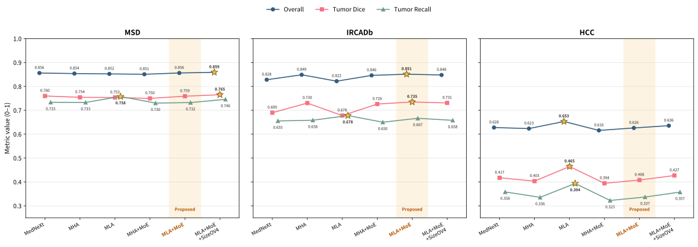

# 面向外部可靠性的肝肿瘤 CT 分割：基于 MedNeXt_MLA_MoE 的跨数据集验证

**作者**：普孟玉  
**单位**：数学学院

## 摘要

肝肿瘤 CT 分割既需要局部纹理与边界表征，也需要利用肝脏范围内的长程上下文。为在三维计算开销可控的条件下结合两者，本文构建 MedNeXt_MLA_MoE：保留 MedNeXt-L 的卷积编码器、解码器和多尺度跳跃连接，仅在最低分辨率 bottleneck 后加入两个由低秩键值自注意力与 MoE 前馈网络组成的 block。本文在 Dataset003/LiTS 风格内部测试集、3D-IRCADb 和 HCCReferencedCT v2 上进行统一评价，并完成 MHA/MLA × MLP/MoE 的控制变量消融。MedNeXt_MLA_MoE 在 3D-IRCADb 上取得 Overall 0.8511、Tumor Dice 0.7349，并将无肿瘤误报率由 MedNeXt 的 60% 降至 40%；但在 HCCReferencedCT v2 上，纯 MedNeXt_MLA 的 Overall 0.6532 高于 MedNeXt_MLA_MoE 的 0.6261。结果表明，强卷积骨干与低分辨率全局上下文具有互补潜力，但 attention–FFN 组合的收益依赖数据域，不能由单一内部分数或单个外部数据集概括。

**关键词**：肝肿瘤分割；MedNeXt；低秩注意力；混合专家；跨数据集验证

## 1. 引言

从 CT 中自动分割肝脏与肿瘤可用于病灶负荷评估、治疗规划和疗效随访。该任务的主要困难包括肿瘤尺度差异、低对比度、小病灶、边界模糊以及血管或低密度结构引起的假阳性，因此模型既要保留局部细节，也要理解病灶与肝脏整体形态的关系。

U-Net 和 nnU-Net 建立了层次化编码器—解码器的强基线 [U-Net-2015; nnU-Net-2021]。MedNeXt 进一步以 depthwise inverted bottleneck 和残差重采样增强三维卷积表征 [MedNeXt-2023]。卷积通过逐层聚合扩大感受野，但远距离关系的建模仍较间接；自注意力可以显式连接任意空间位置，却难以直接应用于高分辨率三维特征。本文因此只在 $8^3$ 的最低分辨率特征上引入全局交互，使高分辨率路径继续负责局部纹理和边界恢复。

内部平均 Dice 也不能充分代表跨中心可靠性。扫描协议、增强时相、病灶负荷和标注来源变化可能造成小病灶漏检、无肿瘤病例误报或边界过分割。本文将结构设计、三数据域验证和病例级失败分析放在同一证据链中，并把数据域依赖的负结果作为结论的一部分。

本文的主要贡献为：

1. 构建 MedNeXt_MLA_MoE，在 MedNeXt-L 最低分辨率 bottleneck 后加入低秩键值自注意力和 MoE-FFN，以局部改动补充全局上下文。
2. 在统一训练和评价条件下完成 MHA/MLA × MLP/MoE 消融，并与卷积、Transformer 及高效卷积基线比较。
3. 在内部测试、3D-IRCADb 和 HCCReferencedCT v2 上分别报告重叠指标、召回率、精确率和适用时的无肿瘤误报，分析跨数据集排名变化与典型失败。

## 2. 相关工作

U-Net、nnU-Net 及其后续工作表明，经过系统配置的卷积 U 形网络仍是医学分割的重要基线 [U-Net-2015; nnU-Net-2021; nnU-Net-Revisited-2024]。ConvNeXt 和 MedNeXt 将 depthwise convolution、inverted bottleneck 与网络扩展策略引入现代卷积网络 [ConvNeXt-2022; MedNeXt-2023]；EfficientMedNeXt、RSB-MedNeXt 和 MedNeXt-v2 则继续从效率、混合 bottleneck 和大规模预训练方向扩展这一范式 [EfficientMedNeXt-2025; RSB-MedNeXt-2025; MedNeXt-v2-2025]。

ViT、UNETR、Swin Transformer 和 SwinUNETR 展示了自注意力在长程依赖和层次化视觉表示中的作用 [ViT-2021; UNETR-2022; Swin-2021; SwinUNETR-2022]。与整体替换卷积路径不同，本文把注意力限制在 MedNeXt 的最低分辨率特征上，以保留卷积局部归纳偏置并控制三维计算量。

本文借鉴 DeepSeek-V2 的共享低秩 K/V 表示，以及 DeepSeekMoE、DeepSeek-V3 中 shared/routed experts 和无辅助损失负载均衡的思想 [DeepSeekMoE-2024; DeepSeek-V2-2024; DeepSeek-V3-2024]。当前实现是面向三维分割的简化模块，不复现自回归 KV cache，也不声称复现完整 DeepSeek 架构。

## 3. 方法

### 3.1 总体架构

MedNeXt_MLA_MoE 以 MedNeXt-L 为 U 形卷积主干。单通道 CT 先经 `stem` 完成 $1\rightarrow32$ 通道投影；四级 encoder stage 的通道数为 32、64、128 和 256，对应 MedNeXtBlock 重复次数 3、4、8 和 8。随后经第四个 DownBlock 得到 512 通道特征，通过 8 个 MedNeXtBlocks 和两个 MLA+MoE blocks 后进入解码器。每一级 decoder 均执行 `UpBlock → 空间形状对齐 → 与对应 x_res_i 逐元素相加 → decoder stage`，而不是通道拼接。

<small><strong>图 1  MedNeXt_MLA_MoE 总体结构。</strong> 色块中的形状均表示模块输出；D、H、W 为输入 patch 的空间尺寸。Input Projection 对应代码中的 <code>stem</code>；encoder skip 取自 DownBlock 之前的 <code>x_res_i</code>。解码路径中的圆圈“+”显式对应 <code>_match_spatial_shape</code> 后的逐元素相加，随后才进入 <code>dec_block_i</code>。训练阶段的四个辅助输出未绘出。</small>

MedNeXtBlock 的主分支依次执行 $3\times3\times3$ depthwise convolution、GroupNorm、$1\times1\times1$ 通道扩展、GELU 和 $1\times1\times1$ 通道投影，再与 block 输入逐元素相加。各 DownBlock/UpBlock 是 stage 之间独立的重采样模块；当前配置 `do_res_up_down=True`，因此其内部另有一条 $1\times1\times1$ 残差重采样支路。该内部残差与 encoder–decoder skip 是两种不同的加法。

### 3.2 MLABottleneck3D

卷积 bottleneck 输出 $[B,512,8,8,8]$，其中每个最低分辨率空间位置已聚合较大范围的卷积语义。`flatten(2)` 和 `transpose(1,2)` 将其变为 $[B,512,512]$：第二维是 512 个空间位置，第三维是每个位置的 512 维特征。这里的 token 指三维特征图中的一个空间位置，不是自然语言词语。序列经过两个 pre-norm MLA+MoE blocks 和最终 LayerNorm 后，再恢复为原三维形状。

<small><strong>图 2  MLABottleneck3D 外层流程。</strong> reshape、flatten 和 transpose 只改变张量排列；可学习计算发生在两个 MLA+MoE blocks 与最终 LayerNorm 中。</small>

每个 block 先计算 $x'=x+\mathrm{MLA}(\mathrm{LN}(x))$，再计算 $y=x'+\mathrm{MoE}(\mathrm{LN}(x'))$，输入和输出形状均为 $[B,512,512]$。

### 3.3 低秩键值自注意力

Query 由 $512\rightarrow512$ 线性投影得到；K 和 V 先共享 $512\rightarrow128$ 低秩投影及 LayerNorm，再由两个独立的 $128\rightarrow512$ 线性层生成。所得 Q、K、V 被分为 8 个 64 维注意力头，计算完整的 $N\times N$ 注意力并经 $512\rightarrow512$ 输出投影。低秩上投影只能重新组合 128 维表示，不能恢复压缩时丢失的信息；当前实现也没有自回归 KV cache 优势，注意力复杂度仍随 token 数平方增长。

<small><strong>图 3  低秩键值自注意力。</strong> K 和 V 共享 128 维低秩表示，但使用两个独立的上投影；完整注意力仅在 $8^3$ bottleneck 上计算。</small>

仅计算无 bias 线性权重时，标准 512 维 K/V 投影含 524,288 个参数，低秩路径含 196,608 个，减少 62.5%；连同 Query 和输出投影，注意力投影参数由 1,048,576 降至 720,896，减少 31.25%。该参数差异不等同于已证明的分割性能增益。

### 3.4 MoE 前馈网络

MoE-FFN 包含一个始终计算的 shared expert、四个 routed experts 和一个 $512\rightarrow4$ 的无 bias 专家选择器。五个 expert 参数独立，均执行 $512\rightarrow1024\rightarrow512$。对每个空间 token，balance bias 只参与 Top-2 专家索引选择，融合权重则由被选专家的原始 scores 经 softmax 得到；最终输出为 shared output 与两个 routed outputs 加权和的逐元素相加。

<small><strong>图 4  MoE 前馈网络。</strong> shared expert 始终生效；专家选择器产生四个分数并选出两个 routed experts。balance bias 决定“选谁”，原始 scores 决定“如何加权”。</small>

当前代码会先计算全部四个 routed-expert outputs，再按 Top-2 索引取值。因此“Top-2”表示只有两个 routed experts 对最终输出有效贡献，并不意味着跳过未选专家获得了实际稀疏计算加速。本文也不把当前线性 Router 或 Top-2 设定表述为最优方案。

### 3.5 训练、数据与评价

所有模型基于 PyTorch 和 nnU-Net v2。训练 patch 为 $128^3$，batch size 为 2，优化器为带 Nesterov 的 SGD（初始学习率 $10^{-2}$、momentum 0.99、weight decay $3\times10^{-5}$），使用 polynomial 学习率衰减并训练 1000 epochs。每个 epoch 含 250 个训练 iteration 和 50 个验证 iteration。训练使用 Dice+CE 深监督，推理采用 nnU-Net sliding window、Gaussian 重叠加权和三轴镜像增强。

| 数据域 | 用途与病例数 | 关键说明 |
|---|---|---|
| Dataset003_Liver | 92 train / 13 val / 26 internal test | 固定 seed=42；internal test 不参与 checkpoint 选择 |
| 3D-IRCADb | 20 external test | 15 个有肿瘤、5 个无肿瘤病例 |
| HCCReferencedCT v2 | 70 train / 10 val / 21 held-out test | 101 例均有肿瘤标注；source-only 评价只使用 21 例 test |

Liver Dice 在全部病例上计算；Tumor Dice、Recall 和 Precision 只在 GT 有肿瘤病例上求病例级均值。$\mathrm{Overall}=(\mathrm{Liver\ Dice}+\mathrm{Tumor\ Dice})/2$。GT 无肿瘤病例的肿瘤指标记为 `N/A`，其风险单独以 No-tumor FP rate 评价。三个数据域分别统计，不计算跨数据集平均排名。正式评价使用与 dataset、trainer、fold 对应的 `checkpoint_best.pth`。

## 4. 实验结果

### 4.1 三数据域总体结果

主比较选取 MedNeXt 系列控制变量、官方 EfficientMedNeXt-L 与 nnU-Net Baseline。完整比较池包含 30 种 Dataset003 source-only 配置，但不同数据域的病例构成不同，排名只在域内解释。

| Method | Internal Overall | IRCADb Overall | IRCADb Tumor | IRCADb FP | HCC Overall | HCC Tumor |
|---|---:|---:|---:|---:|---:|---:|
| Baseline | 0.8368 | 0.8305 | 0.6937 | 60% | 0.2511 | 0.0000 |
| EfficientMedNeXt-L | 0.8518 | 0.8315 | 0.6973 | 60% | 0.5921 | 0.3468 |
| MedNeXt | 0.8561 | 0.8280 | 0.6900 | 60% | 0.6279 | 0.4175 |
| MedNeXt_MHA | 0.8538 | 0.8487 | 0.7303 | 60% | 0.6235 | 0.4035 |
| MedNeXt_MLA | 0.8524 | 0.8219 | 0.6778 | 60% | **0.6532** | **0.4645** |
| MedNeXt_MHA_MoE | 0.8508 | 0.8463 | 0.7261 | **40%** | 0.6158 | 0.3943 |
| MedNeXt_MLA_MoE | 0.8562 | **0.8511** | **0.7349** | **40%** | 0.6261 | 0.4080 |
| MedNeXt_MLA_MoE_SizeOV4 | **0.8591** | 0.8479 | 0.7309 | 60% | 0.6356 | 0.4269 |

<small><strong>图 5  核心 MedNeXt 配置的三数据域结果。</strong> 星号标记各数据域内相应指标的最高值，浅色背景标出本文主方法 MedNeXt_MLA_MoE。三个子图使用相同纵轴，但不对异质数据域求平均。</small>

Dataset003 internal、IRCADb 和 HCC 的最优配置分别为 MedNeXt_MLA_MoE_SizeOV4、MedNeXt_MLA_MoE 和 MedNeXt_MLA。与 MedNeXt 相比，MedNeXt_MLA_MoE 在 IRCADb 的 Tumor Dice、Overall 和 Precision 分别提高 0.0449、0.0231 和 0.0551，FP rate 由 60% 降至 40%；但其 HCC Overall 为 0.6261，略低于 MedNeXt 的 0.6279，明显低于 MedNeXt_MLA 的 0.6532。因此，IRCADb 收益不能概括为统一的外部泛化优势。

### 4.2 Attention–FFN 消融

| Method | Attention | FFN | Internal Overall | IRCADb Overall | IRCADb FP | HCC Overall |
|---|---|---|---:|---:|---:|---:|
| MedNeXt | None | None | 0.8561 | 0.8280 | 60% | 0.6279 |
| MedNeXt_MHA | MHA | MLP | 0.8538 | 0.8487 | 60% | 0.6235 |
| MedNeXt_MLA | MLA | MLP | 0.8524 | 0.8219 | 60% | **0.6532** |
| MedNeXt_MHA_MoE | MHA | MoE | 0.8508 | 0.8463 | **40%** | 0.6158 |
| MedNeXt_MLA_MoE | MLA | MoE | **0.8562** | **0.8511** | **40%** | 0.6261 |

固定 MLP 时，MHA 相比 MLA 的 Internal/IRCADb/HCC Overall 变化为 +0.0014/+0.0268/-0.0297；固定 MLA 时，MoE 的变化为 +0.0038/+0.0292/-0.0271；固定 MHA 时，MoE 则为 -0.0030/-0.0024/-0.0077。MoE 的作用随 attention 路径和数据域改变，现有结果支持组合交互效应，不支持 MLA 或 MoE 的统一三域增益。SizeOV4 使主方法的 Internal/HCC Overall 小幅上升，却使 IRCADb Overall 由 0.8511 降至 0.8479、FP rate 由 40% 回升至 60%，因此不作为主结构贡献。

### 4.3 外部可靠性与病例分析

IRCADb 的 5 个无肿瘤病例中，MedNeXt_MLA_MoE 和 MedNeXt_MHA_MoE 均误报 2 例，其余表中核心方法误报 3 例。`ircadb_016` 上，MedNeXt 和 MedNeXt_MLA_MoE 的 Tumor Dice 分别为 0.2546 和 0.8121，说明总体改善集中于部分困难病例；另一方面，`ircadb_014` 仍出现持续假阳性，`ircadb_015` 的小病灶在边界切片漏检、随后仅部分恢复。

<small><strong>图 6  IRCADb 病例级改善与代表性失败。</strong> A：主方法消除 MedNeXt 在 <code>ircadb_016</code> 的大片假阳性；B：<code>ircadb_014</code> 的无肿瘤病例误报仍未解决；C、D1–D3：<code>ircadb_015</code> 的小病灶由漏检到相邻切片部分恢复。绿色为 GT，黄色为预测，红色为 FP，蓝色为 FN。</small>

HCC 21 例均有肿瘤标注，因而 No-tumor FP rate 为 `N/A`。其中 11 例被至少一半的 30 种方法严重分割失败，6 例被全部方法严重分割失败，反映出 source-only 条件下的共同域偏移。进一步的 bottleneck-only HCC Adapter 也产生负迁移：相对同一主模型 source-only 结果，Overall 从 0.6261 降至 0.4034，Tumor Dice 从 0.4080 降至 0.1497，严重失败由 10 例增至 16 例。这说明域差异可能同时存在于输入强度、早期纹理、多尺度 skip 和解码边界恢复，而非只位于最低分辨率语义特征。

## 5. 讨论

实验支持“强 DW+IB 卷积骨干负责局部表征、最低分辨率 attention 补充全局交互”这一受控组合方向，但没有证明某个组件普遍优于其他选择。MedNeXt_MLA_MoE 在 internal 与原始 MedNeXt 基本持平，在 IRCADb 改善明显，却未在 HCC 取得最优；MHA/MLA 和 MLP/MoE 的相对关系也随数据域反转。由此可见，单一内部排名无法代替外部验证，单个外部数据集上的增益也不能直接归因为 MLA 或 MoE 的普遍泛化能力。

病例图提示，全局上下文可能帮助模型抑制部分与肿瘤相似的局部响应，但该解释尚未由 attention map、特征可视化或重复实验直接证明。当前 MoE 还会计算全部 routed experts，因此参数组织上的条件变换不等于真实计算稀疏化。论文对机制的表述应保持为与观察一致的解释，而不是已被验证的因果结论。

本文的局限包括：仅使用固定 fold_0，缺少多 fold、多随机种子和置信区间；两个外部测试集规模有限且病例构成不同，HCC 不能评价无肿瘤误报；低对比度和极小病灶仍存在共同失败；尚未完成 attention 可视化、不确定性分析和统一硬件效率 benchmark。后续应优先补充重复实验、分病灶尺度统计和多中心验证。

## 6. 结论

本文在 MedNeXt-L 最低分辨率 bottleneck 后结合简化低秩键值自注意力与 MoE-FFN，并通过内部测试、两个外部数据集和病例级分析评价其可靠性。该组合在 IRCADb 上改善肿瘤分割和部分无肿瘤误报，但不同数据域的最优配置并不一致。肝肿瘤分割方法的有效性应由受控消融、跨数据集结果和失败模式共同界定，而不能只依赖单一 Dice 或单组件归因。

## 参考文献

- [U-Net-2015] Ronneberger, O., Fischer, P., Brox, T. *U-Net: Convolutional Networks for Biomedical Image Segmentation*. MICCAI, 2015.
- [nnU-Net-2021] Isensee, F., et al. *nnU-Net: a self-configuring method for deep learning-based biomedical image segmentation*. Nature Methods, 2021.
- [ViT-2021] Dosovitskiy, A., et al. *An Image Is Worth 16×16 Words*. ICLR, 2021.
- [UNETR-2022] Hatamizadeh, A., et al. *UNETR: Transformers for 3D Medical Image Segmentation*. WACV, 2022.
- [Swin-2021] Liu, Z., et al. *Swin Transformer: Hierarchical Vision Transformer Using Shifted Windows*. ICCV, 2021.
- [ConvNeXt-2022] Liu, Z., et al. *A ConvNet for the 2020s*. CVPR, 2022.
- [SwinUNETR-2022] Hatamizadeh, A., et al. *Swin UNETR*. arXiv:2201.01266, 2022.
- [MedNeXt-2023] Roy, S., et al. *MedNeXt: Transformer-driven Scaling of ConvNets for Medical Image Segmentation*. MICCAI, 2023.
- [nnU-Net-Revisited-2024] Isensee, F., et al. *nnU-Net Revisited: A Call for Rigorous Validation in 3D Medical Image Segmentation*. MICCAI, 2024.
- [EfficientMedNeXt-2025] Rahman, M. M., et al. *EfficientMedNeXt*. MICCAI, 2025.
- [RSB-MedNeXt-2025] Pham, C. T., et al. *RSB-MedNeXt*. ISPRS Archives, 2025.
- [MedNeXt-v2-2025] Roy, S., et al. *MedNeXt-v2*. arXiv:2512.17774, 2025.
- [DeepSeekMoE-2024] Dai, D., et al. *DeepSeekMoE*. arXiv:2401.06066, 2024.
- [DeepSeek-V2-2024] DeepSeek-AI. *DeepSeek-V2*. arXiv:2405.04434, 2024.
- [DeepSeek-V3-2024] DeepSeek-AI. *DeepSeek-V3 Technical Report*. arXiv:2412.19437, 2024.
